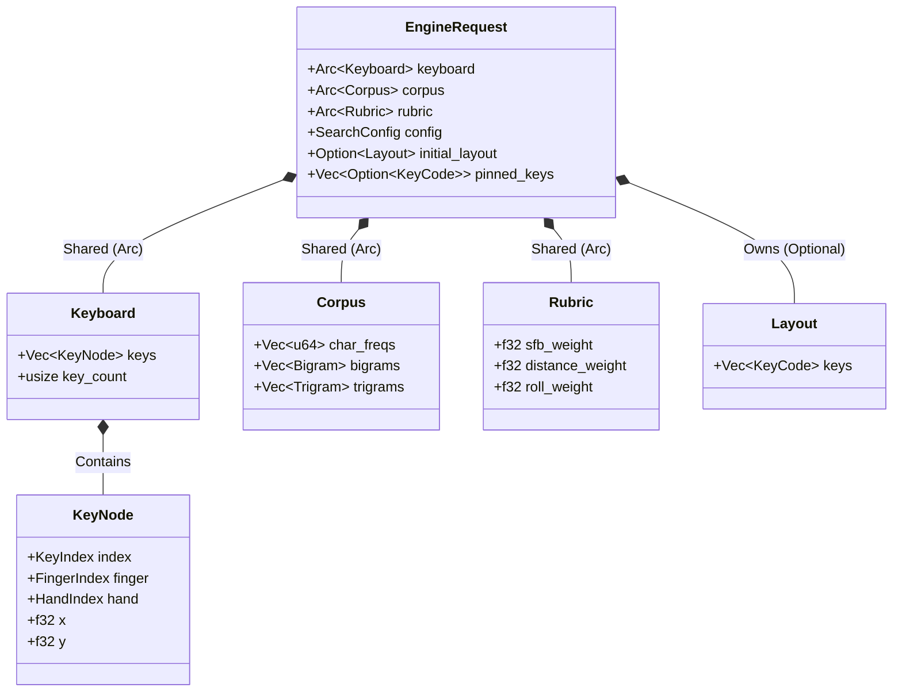
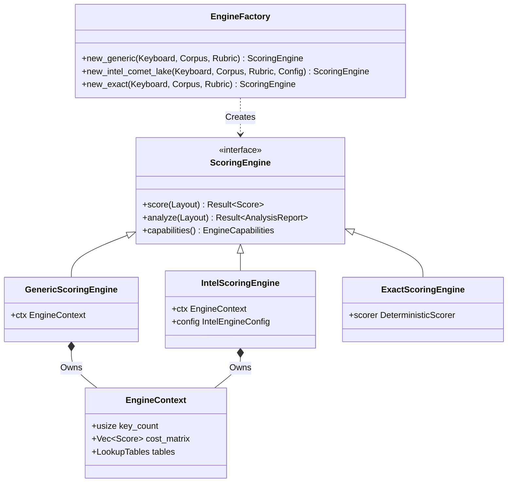
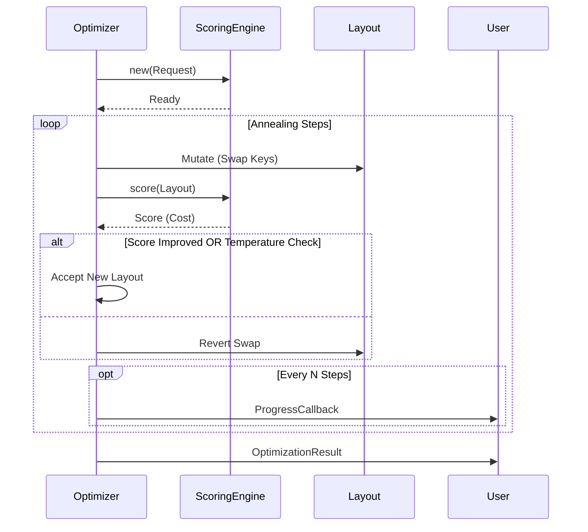

# Entity Relationship Models

**Version:** 4.0
**Context:** `keyforge-model` and `keyforge-physics` Aggregates.

## 1. The Optimization Aggregate

The `EngineRequest` is the root aggregate that defines a "Job". It is composed of immutable reference data (`Arc`) and mutable configuration.

## 2. The Scoring Engine (Compiler Pattern)

The `ScoringEngine` is a trait that abstracts different high-performance implementations. The `EngineFactory` is used to instantiate the appropriate engine based on requirements (Exact vs Optimized).

## 3. The Evolution Loop

The `Optimizer` orchestrates the mutation of the `Layout` using the `ScoringEngine` as an oracle.

