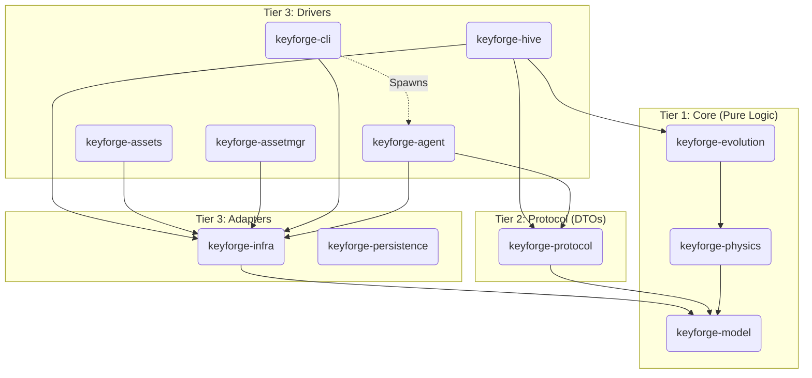

# System Context (Ports & Adapters)

**Version:** 4.4
**Context:** Crate Boundaries and Interface Definitions.

## The Ports (Application Contracts)

These traits define how the Core communicates with the World.

### 1. Evolution Port (`libs/keyforge-evolution`)

The interface for reporting optimization progress without coupling to IO.

```rust
pub trait ProgressCallback: Send + Sync {
    /// Called periodically with the current optimization state.
    /// Returns `true` to continue, `false` to abort (e.g. user cancellation).
    fn on_progress(&self, epoch: usize, score: f32, layout: &[KeyCode], ips: f32) -> bool;
}
```

### 2. Infrastructure Port (`libs/keyforge-infra`)

The interface for accessing the outside world (Filesystem, Network, DB, Coordination).

```rust
// Inferred from usages in `libs/keyforge-infra/src/asset/manager.rs`
pub trait AssetManager {
    fn get_keyboard(&self, name: &str) -> InfraResult<Keyboard>;
    fn get_corpus(&self, name: &str) -> InfraResult<Corpus>;
}

// Inferred from `libs/keyforge-infra/src/repo/user_repo.rs`
pub trait JobRepository {
    fn save_job(&self, job: JobRequest) -> InfraResult<JobId>;
    fn get_status(&self, id: JobId) -> InfraResult<JobStatus>;
}

// Inferred from `libs/keyforge-infra/src/net/distributed.rs`
pub trait Coordinator {
    /// Distributed locking for hardware profile registration (Write Shield).
    async fn try_reserve_profile_update(&self, cpu_signature: &str) -> InfraResult<bool>;
    
    /// Real-time telemetry for active nodes.
    async fn update_heartbeat(&self, node_id: &str, telemetry: &NodeTelemetry) -> InfraResult<()>;
    
    /// Retrieve binary blobs (assets) from the distributed store.
    async fn get_bin(&self, key: &str) -> InfraResult<Option<bytes::Bytes>>;
}
```

## The Dependency Graph


