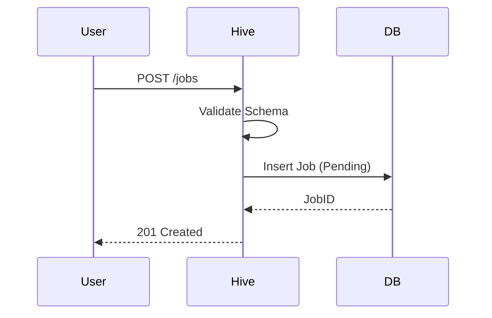
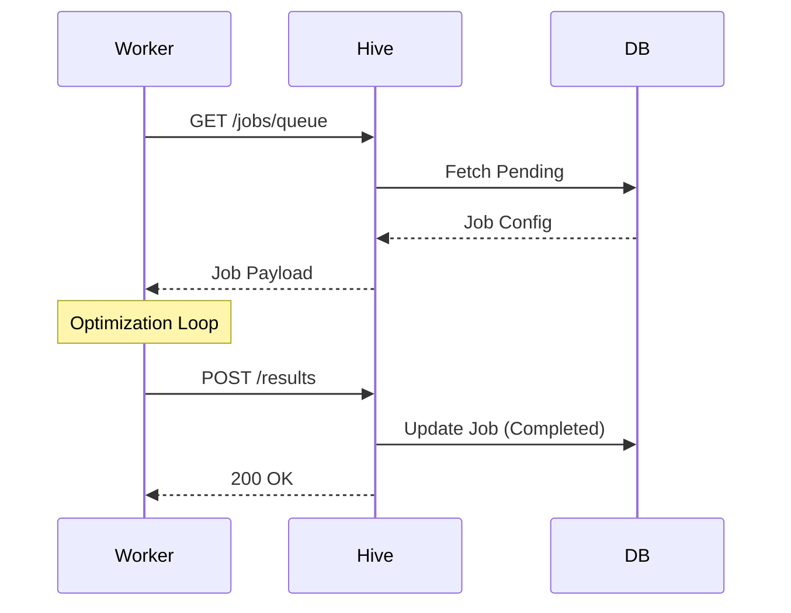
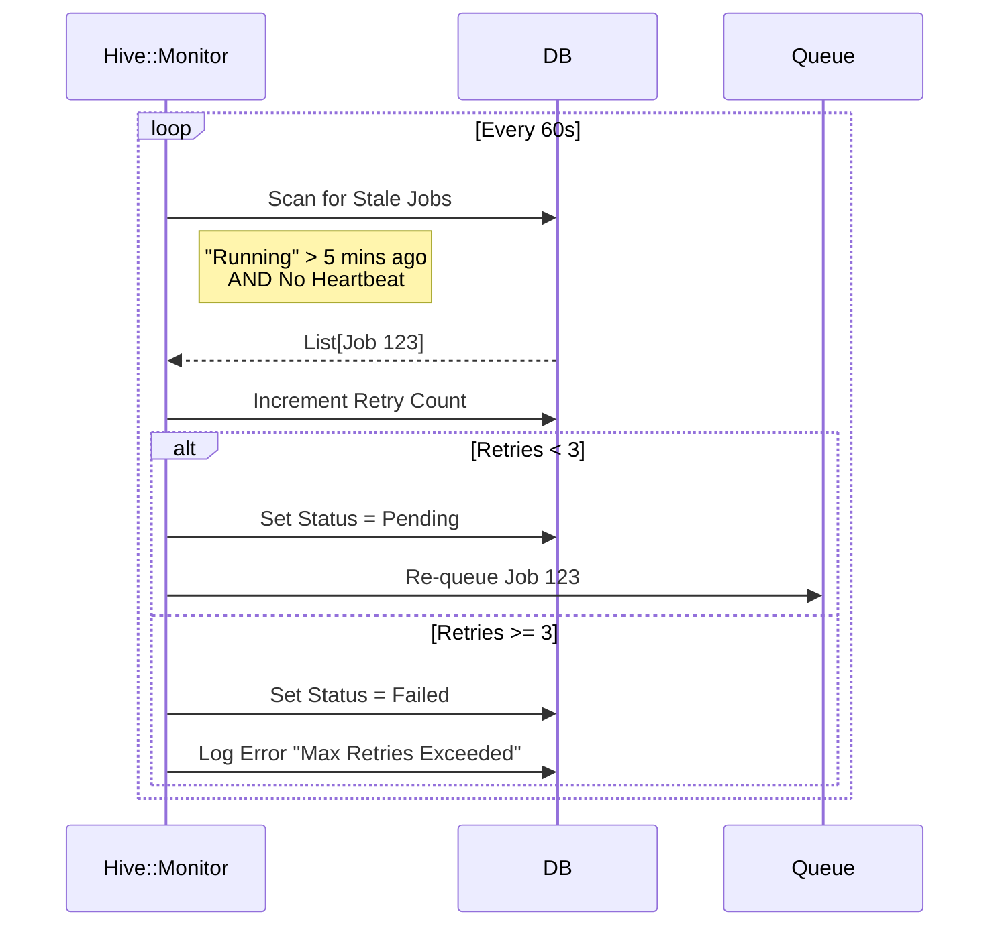
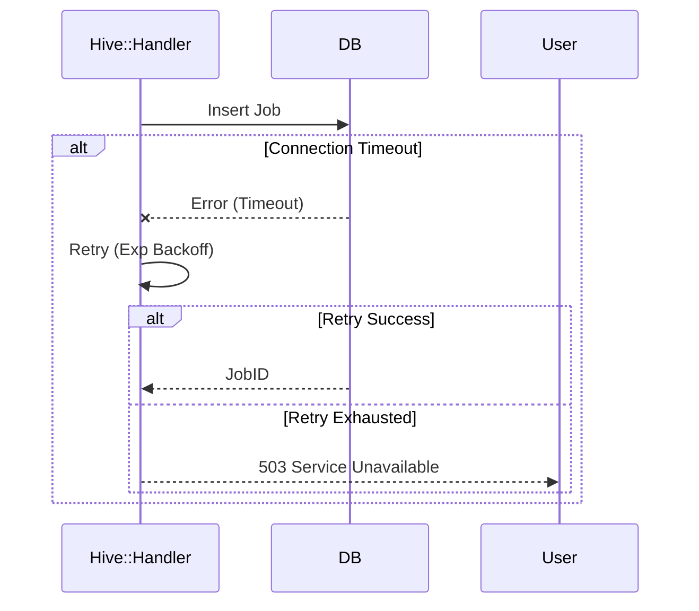

# Data Flow & Sequences

**Version:** 4.0
**Context:** Runtime behavior, including Failure Modes.

## 1. Job Submission (Happy Path)

## 2. Worker Execution (Happy Path)

## 3. Failure Mode: Worker Crash (Heartbeat Timeout)

What happens when a worker pulls a job but dies before finishing?

## 4. Failure Mode: Database Timeout

What happens when the DB is under load?

