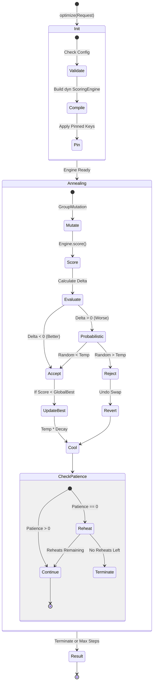
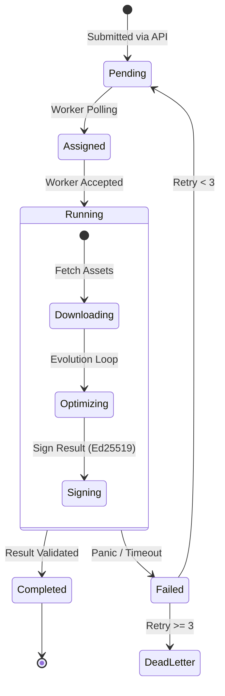

# State Models & Lifecycles

**Version:** 4.0
**Context:** Finite State Machines (FSM) governing system behavior.

## 1. The Optimization Loop (Annealing)

This process runs inside `keyforge-evolution`. It is synchronous and CPU-bound.

## 2. The Worker Job Lifecycle

The lifecycle of a Job as it moves through the distributed system.

