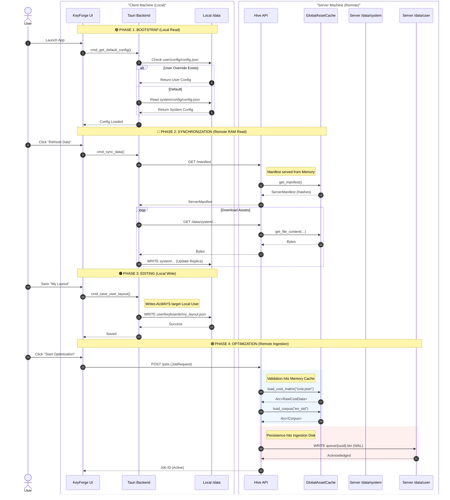

# UI Data Interaction Lifecycle

This diagram illustrates the data flow across the distributed system, explicitly differentiating between the **Local Workspace** (Client) and the **Remote Authority** (Server).

**Key Distinctions:**

1. **Local Data:** Used for UI rendering, configuration, and local storage of custom layouts.
2. **Server Data:** Split into **System** (Authority) and **User** (Ingestion).

## Directory Roles & Locations

| Context | Path | Role | Access Pattern | Content |
| :--- | :--- | :--- | :--- | :--- |
| **Client** | `/data/system` | **Replica** | **Read-Only** | Synced copy of standard assets (keyboards, corpora). |
| **Client** | `/data/user` | **Workspace** | **Read-Write** | User-created layouts, uploaded corpora, temporary job queues, logs. |
| **Server** | `/data/system` | **Authority** | **Read-Only** | The canonical source of truth. Accessed via **RAM** (Cache) for Sync & Compute. |
| **Server** | `/data/user` | **Ingestion** | **Write-Only** | Incoming Job Queue (`user/queue`) and Dead Letter Queue (`user/dlq`). |
