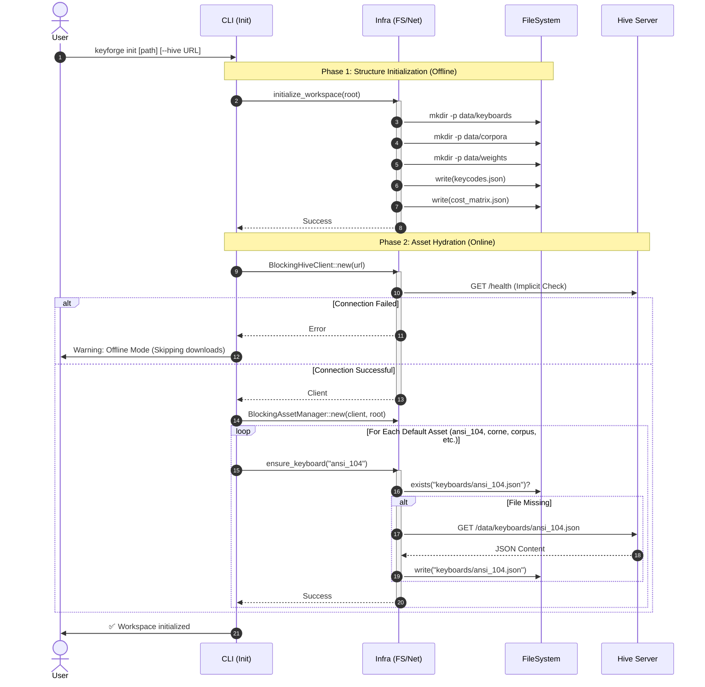

# KeyForge CLI Init Sequence Diagram

This diagram illustrates the execution flow of the `keyforge init` command, showing how the workspace structure is created and how default assets are synchronized from the Hive server.

