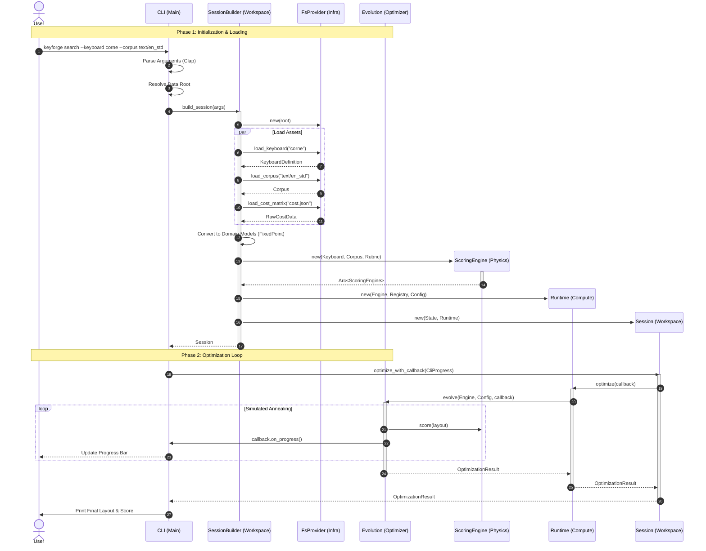

# KeyForge CLI Sequence Diagram

This diagram illustrates the execution flow of the `keyforge search` command, demonstrating the interaction between the CLI, Infrastructure, Workspace, and Compute layers.

