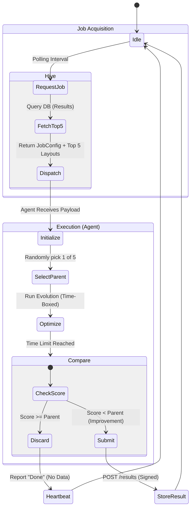
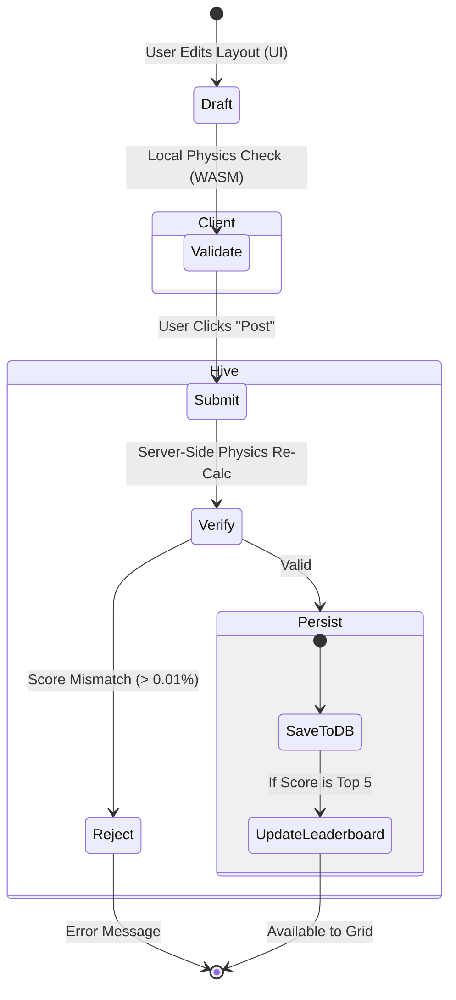
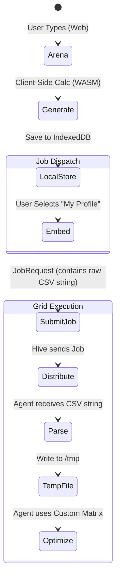

# Search Lifecycle & Interaction Flows

This document defines the state transitions for the core KeyForge loops: Distributed Search, User Submission, and Asset Management.

## 1. The Distributed Search Loop (Worker)

**Goal:** Efficiently distribute compute while preventing "Local Optima" traps and reducing network noise.

**Key Logic:**

* Diversity: Hive sends top 5 layouts; Agent picks one randomly.
* Silence: Agent only submits results if they beat the parent score.
* Time-Boxing: Agent runs for a fixed duration, not fixed steps.

## 2. The User Submission Loop

**Goal:** How a user layout enters the global gene pool.

**Key Logic:** Server-side physics verification prevents "Fake Score" attacks.

## 3. The Asset Lifecycle (Custom Matrices)

**Goal:** How a custom biometric profile moves from the Web Arena to the Distributed Grid without server-side file management.

**Key Logic:** Data is embedded in the Job Request (Stateless).

