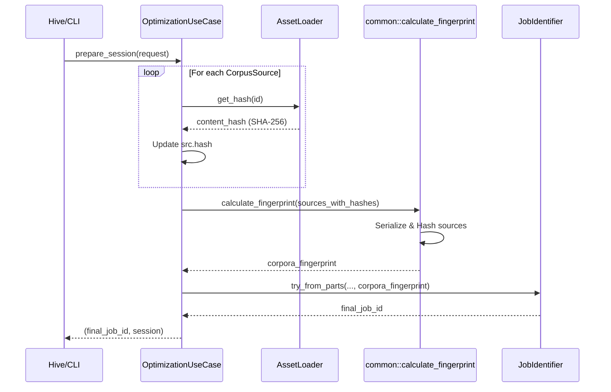

# Architectural Shift: Content-Addressable Job IDs (DATA-005)

**Status:** Implementation Phase 2 (Mapping)
**Track:** #151

## C4 Container Diagram: Identity Resolution Flow

## Impact Analysis Summary

1. **libs/keyforge-infra**:
    - `ValkeyProvider::get_hash` must be reliable and linked to the actual blob content in the store.
    - `calculate_fingerprint` should potentially use a more robust canonicalization than `serde_json::to_vec`.
2. **libs/keyforge-compute**:
    - `OptimizationUseCase` currently attempts to resolve hashes but falls back silently if `loader.get_hash` fails.
    - **Requirement**: Make hash resolution mandatory for Job ID generation.
3. **libs/keyforge-adapter**:
    - `AssetLoader` trait `get_hash` needs clear documentation that it MUST be content-addressable.
    - `InMemoryLoader` needs to store and return real hashes of injected objects.

## Verification Strategy

- **Consistency Test**: Update a corpus, reload, and verify `JobIdentifier` changes.
- **Cache Miss Verification**: Ensure `CompiledEngineCache` correctly re-compiles when the Job ID shifts due to content changes.
