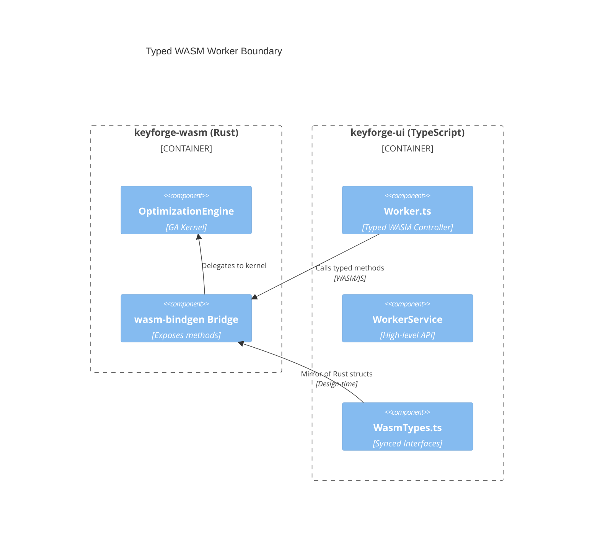

# Architectural Shift: Typed UI-WASM Integration (UI-TYPE-001)

**Status:** Implementation Phase 2 (Mapping)
**Track:** #158

## C4 Container Diagram: WASM Interop Bridge

## Impact Analysis Summary

1. **libs/keyforge-wasm**:
    - Add `TrainingUpdate` struct with `score: Score`, `ips: f64`, `epoch: u64`.
    - Expose `get_training_update(&self) -> TrainingUpdate` on `OptimizationEngine`.
2. **apps/keyforge-ui**:
    - Replace `any` in `src/api/worker.ts` with explicit interfaces.
    - Implement `SeedablePrng` in `src/utils/math.ts` to replace `Math.random()`.
    - Update `services/coverage.ts` to use deterministic scoring.
3. **Synchronization**:
    - Establish a pattern for keeping TS types in sync with Rust (e.g., using `ts-rs` or verified manual mirror).

## Verification Strategy

- **Type Check**: `tsc` must pass with `noImplicitAny` enabled for the worker path.
- **Visual Parity**: Optimization progress bars in the UI must move in sync with actual engine epochs.
- **Deterministic Arena**: Arena results must be identical across multiple runs with the same seed.
