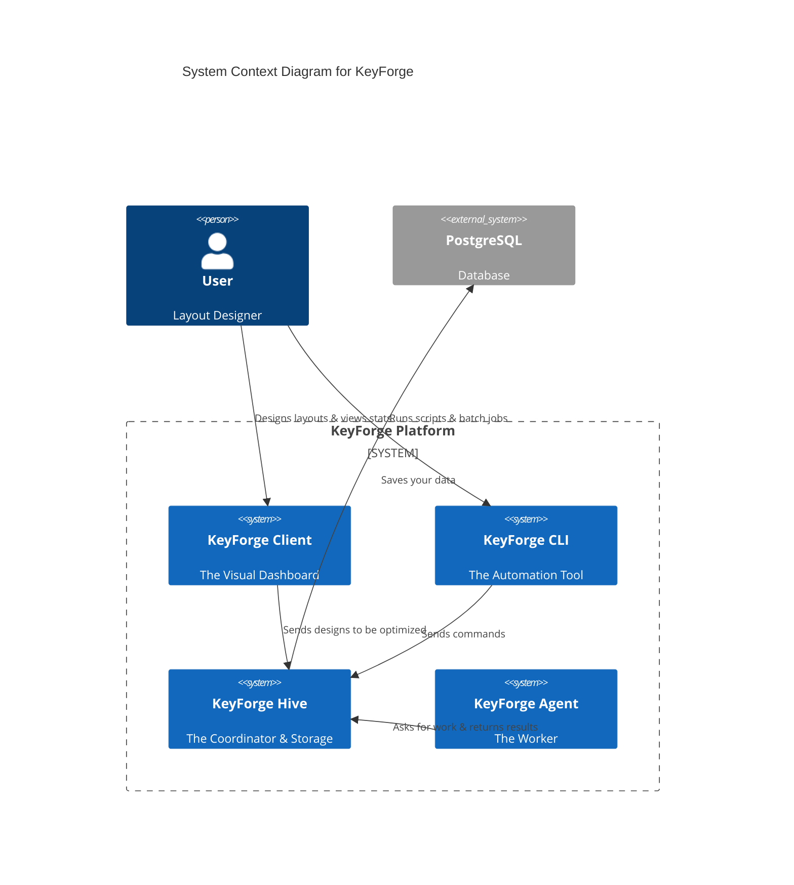

# System Context

KeyForge is a distributed platform designed to help you create the perfect keyboard layout. It splits the work into four distinct parts to ensure the interface remains fast while heavy calculations happen in the background.

## Component Responsibilities

### 1. KeyForge Client (The Interface)

**For You:** This is your main workspace. It provides a visual interface to design layouts, view heatmaps of finger usage, and configure optimization settings.
**System Role:** It translates your visual designs into data structures and sends them to the **Hive** for processing.

### 2. KeyForge Hive (The Brain)

**For You:** The central server that ensures your work is never lost. It manages the queue of optimization jobs so you can run multiple experiments at once.
**System Role:** It acts as the "Traffic Controller." It receives jobs from the **Client**, stores them in the database, and hands them out to available **Agents**. It also verifies that results are valid before saving them.

### 3. KeyForge Agent (The Muscle)

**For You:** A background program that does the heavy lifting. By running this separately, your main interface stays smooth and responsive, even while the computer performs millions of calculations per second.
**System Role:** It connects to the **Hive**, asks "Is there work to do?", performs the complex genetic algorithms to find better layouts, and reports the results back.

### 4. KeyForge CLI (The Power Tool)

**For You:** A command-line tool for advanced users who want to automate tasks, such as generating custom corpus data from text files or running opt
