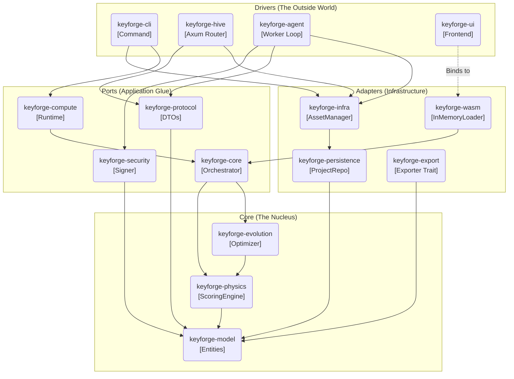

# System Architecture Map

**Context:** High-level dependency graph overlaying the Hexagonal Architecture.
**Interaction:** Click on a component in the diagram or use the [Component Index](#component-index) below.

## Component Index

Use these links to navigate the design documentation if the diagram is not interactive.

### 1. Drivers (The Apps)

* [**keyforge-cli**](./keyforge-cli/README.md) - Command Line Interface.
* [**keyforge-hive**](./keyforge-hive/README.md) - Server & API.
* [**keyforge-agent**](./keyforge-agent/README.md) - Worker Node.
* [**keyforge-ui**](./keyforge-ui/README.md) - Frontend Application.

### 2. Adapters (The IO)

* [**keyforge-infra**](./keyforge-infra/README.md) - Asset Manager & Repos.
* [**keyforge-persistence**](./keyforge-persistence/README.md) - Project State.
* [**keyforge-wasm**](./keyforge-wasm/README.md) - Browser Bindings.
* [**keyforge-export**](./keyforge-export/README.md) - Firmware Generation.

### 3. Ports (The Glue)

* [**keyforge-core**](./keyforge-core/README.md) - Orchestration.
* [**keyforge-compute**](./keyforge-compute/README.md) - Runtime Builder.
* [**keyforge-security**](./keyforge-security/README.md) - Signing & Secrets.
* [**keyforge-protocol**](../architecture/06_API_SURFACE.md) - DTOs & API Contract.

### 4. Core (The Nucleus)

* [**keyforge-physics**](./keyforge-physics/README.md) - Scoring Engine & Compiler.
* [**keyforge-evolution**](./keyforge-evolution/README.md) - Annealing Loop.
* [**keyforge-model**](../architecture/01_DOMAIN_DICTIONARY.md) - Domain Entities.

## Layer Definitions

1. **Drivers:** Entry points that drive the application. They parse user input (CLI args, HTTP requests) and call the Application Layer.
2. **Adapters:** Implementations of abstract interfaces for IO (Filesystem, Network, Database).
3. **Ports:** The "Glue" layer. Defines the shape of the application (Runtime, Security protocols, DTOs) without binding to specific IO.
4. **Core:** Pure business logic. Zero dependencies on the outer layers. Deterministic and testable.
