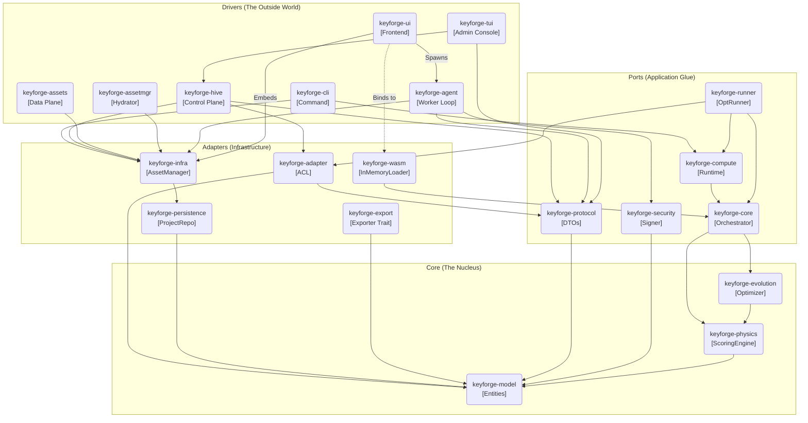

# System Architecture Map

**Context:** High-level dependency graph overlaying the Hexagonal Architecture.
**Interaction:** Click on a component in the diagram or use the [Component Index](#component-index) below.

## Component Index

Use these links to navigate the design documentation if the diagram is not interactive.

### 1. Drivers (The Apps)

* [**keyforge-cli**](./apps/keyforge-cli/README.md) - Command Line Interface.
* [**keyforge-hive**](./apps/keyforge-hive/README.md) - Control Plane Server (Jobs, Auth).
* [**keyforge-assets**](./apps/keyforge-assets/README.md) - Data Plane Server (Static Assets).
* [**keyforge-assetmgr**](./apps/keyforge-assetmgr/README.md) - Asset Hydration Utility.
* [**keyforge-agent**](./apps/keyforge-agent/README.md) - Worker Node.
* [**keyforge-ui**](./apps/keyforge-ui/README.md) - Frontend Application.
* [**keyforge-tui**](./apps/keyforge-tui/README.md) - Admin Console Monitor.

### 2. Adapters (The IO)

* [**keyforge-infra**](./libs/keyforge-infra/README.md) - Asset Manager & Repos.
* [**keyforge-persistence**](./libs/keyforge-persistence/README.md) - Project State.
* [**keyforge-wasm**](./libs/keyforge-wasm/README.md) - Browser Bindings.
* [**keyforge-export**](./libs/keyforge-export/README.md) - Firmware Generation.
* [**keyforge-adapter**](./libs/keyforge-adapter/README.md) - Anti-Corruption Layer.
* [**keyforge-testing**](./libs/keyforge-testing/README.md) - Test Harness.

### 3. Ports (The Glue)

* [**keyforge-core**](./libs/keyforge-core/README.md) - Orchestration.
* [**keyforge-compute**](./libs/keyforge-compute/README.md) - Runtime Builder.
* [**keyforge-runner**](./libs/keyforge-runner/README.md) - Optimization Runner.
* [**keyforge-security**](./libs/keyforge-security/README.md) - Signing & Secrets.
* [**keyforge-protocol**](./libs/keyforge-protocol/README.md) - DTOs & API Contract.

### 4. Core (The Nucleus)

* [**keyforge-physics**](./libs/keyforge-physics/README.md) - Scoring Engine & Compiler.
* [**keyforge-evolution**](./libs/keyforge-evolution/README.md) - Annealing Loop.
* [**keyforge-model**](../architecture/01_DOMAIN_DICTIONARY.md) - Domain Entities.

## Layer Definitions

1. **Drivers:** Entry points that drive the application. They parse user input (CLI args, HTTP requests) and call the Application Layer.
2. **Adapters:** Implementations of abstract interfaces for IO (Filesystem, Network, Database).
3. **Ports:** The "Glue" layer. Defines the shape of the application (Runtime, Security protocols, DTOs) without binding to specific IO.
4. **Core:** Pure business logic. Zero dependencies on the outer layers. Deterministic and testable.
