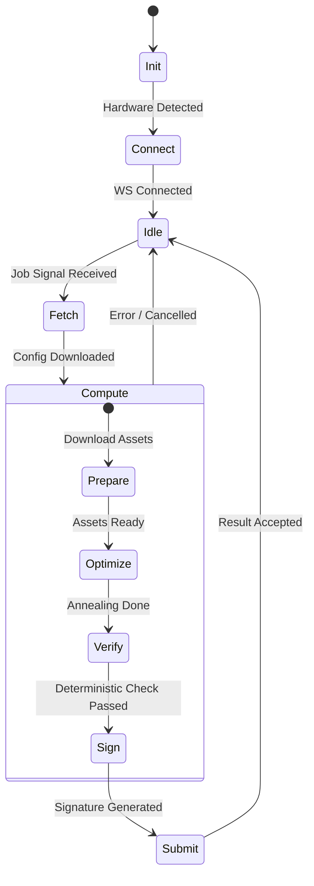

# Design: KeyForge Agent

**Responsibility:** Distributed computation (Worker).
**Tier:** 3 (The Driver)

## 1. The Execution Loop

The Agent is a state machine that cycles between Polling, Computing, and Reporting.

## 2. Security Measures

* **Deterministic Verification:** The Agent re-runs the best layout through `DeterministicScorer` (Integer Math) to ensure the score is exact before signing.
* **Ed25519 Signing:** Every result is signed with the node's private key. The Hive verifies this signature to prevent spoofing.
