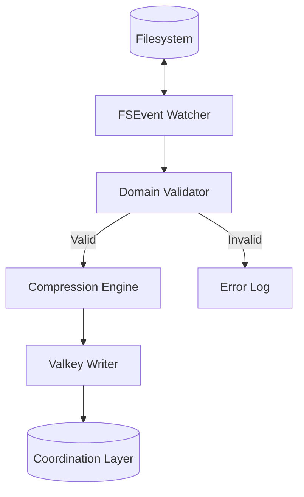
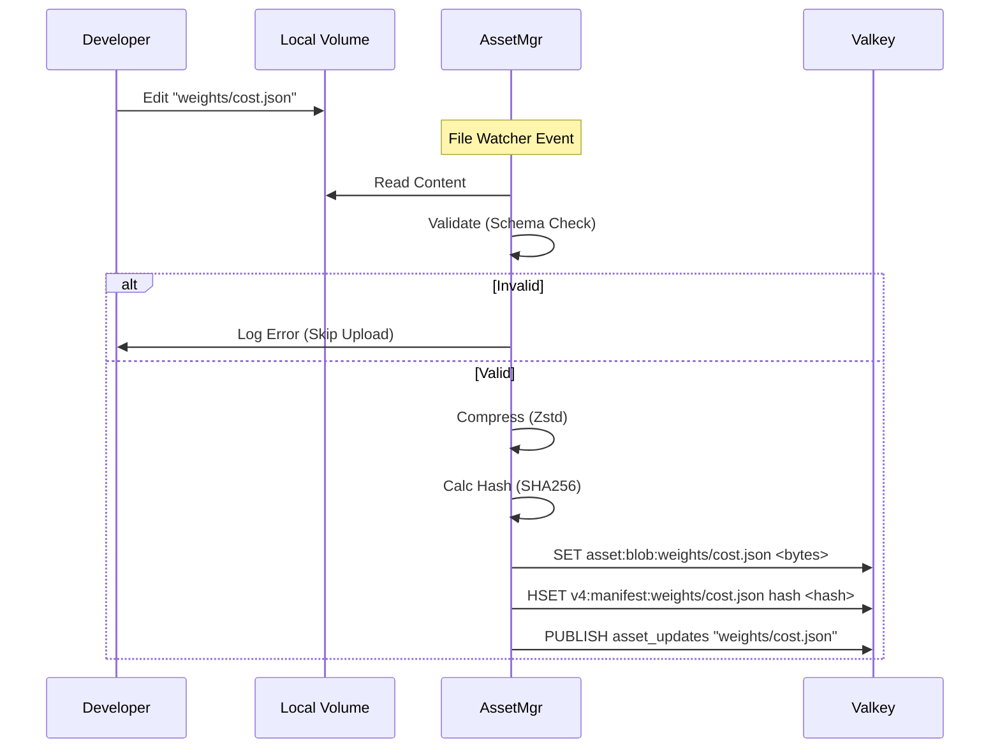

# Design: KeyForge Asset Manager

**Responsibility:** Authoritative lifecycle management of system assets.
**Tier:** 3 (The Daemon)

## 1. Core Philosophy: The Write Master

`keyforge-assetmgr` is the **single source of truth** for the state of assets in the distributed cluster. It is the only component permitted to **write** to the Asset keyspace in Valkey.

Unlike a simple loader, the Asset Manager is a long-running daemon that actively enforces consistency between the Source (Disk/Git) and the State (Valkey).

### Responsibilities

1.  **Hydration (Startup):** Populates Valkey with the current state of the filesystem on boot.
2.  **Synchronization (Hot Reload):** Watches the filesystem for changes. When a developer or admin updates a JSON file, the manager immediately propagates the change to the cluster.
3.  **Validation (The Gatekeeper):** Before uploading any asset to Valkey, the Manager performs strict schema and logic validation (using `keyforge-model`). Invalid assets are rejected and logged; they **never** reach the serving layer.
4.  **Garbage Collection:** Detects removed files and purges their corresponding keys from Valkey to prevent cache bloat.

## 2. Architecture

## 3. Data Flow (The Write Loop)

## 4. Modes of Operation

*   **`daemon` (Default):** Performs initial hydration and then enters a blocking loop to watch for file changes.
*   **`hydrate`:** Performs a one-time synchronization and exits (useful for CI/CD pipelines).
*   **`verify`:** Runs validation logic against the filesystem without connecting to Valkey (dry run).

## 5. Operational Invariants

*   **Write Exclusivity:** No other service (Hive, Assets, CLI) writes to `asset:blob:*`.
*   **Validity Guarantee:** If a key exists in Valkey, it is guaranteed to be a valid, loadable asset.
*   **Eventual Consistency:** There is a non-zero latency between a disk write and a Valkey update, but the Manager ensures convergence.
