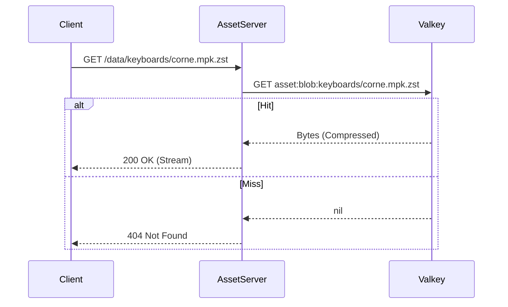

# Design: KeyForge Assets

**Responsibility:** High-performance serving of static system assets.
**Tier:** 3 (The Driver)

## 1. Architecture: The Data Plane

`keyforge-assets` is a stateless HTTP server designed to serve read-only content from the distributed coordination layer (Valkey). It relieves `keyforge-hive` (The Control Plane) from I/O heavy operations.

### Deployment Model

*   **Stateless (Cloud):** No local disk dependency. All data comes from Valkey.
*   **Embedded (Local):** Reads directly from filesystem via `FsProvider` (used in UI).
*   **Scalable:** Can be replicated infinitely behind a Load Balancer.
*   **Public:** Read-only access does not require authentication (simplifies client logic, relies on Hash Verification for integrity).

## 2. Interfaces

### HTTP Endpoints

| Method | Path | Description | Source |
| :--- | :--- | :--- | :--- |
| `GET` | `/manifest` | Returns a JSON map of `{ "path": "hash" }` for all system assets. | `v4:manifest:*` |
| `GET` | `/data/*` | Streams the binary content of a file. | `asset:blob:<path>` |
| `GET` | `/health` | Liveness check (Valkey connectivity). | `PING` |

## 3. Data Flow

## 4. Dependencies

*   **`keyforge-infra`**: Uses `AssetServerProvider` trait to abstract the storage backend (e.g., `ValkeyProvider` for cloud, `FsProvider` for local).
*   **`axum`**: HTTP framework.
