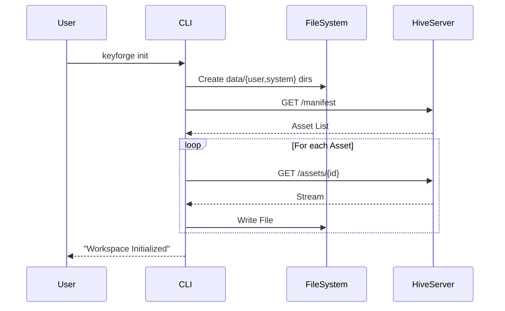
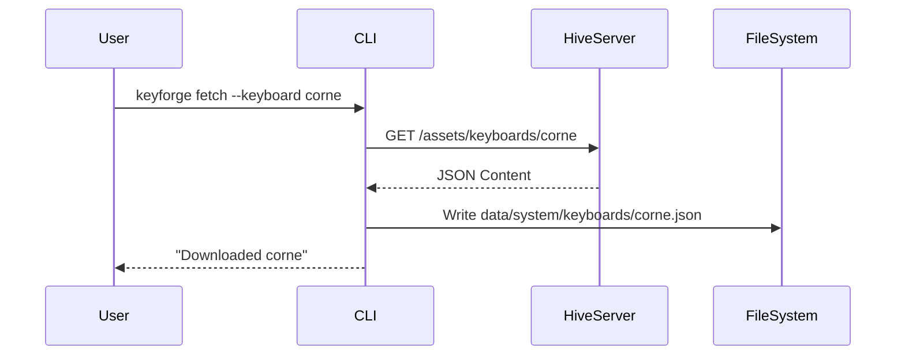
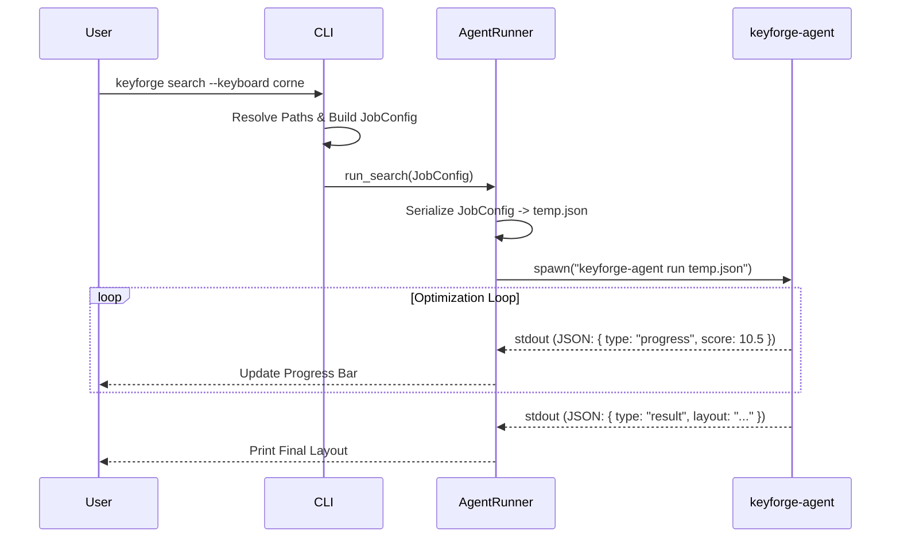
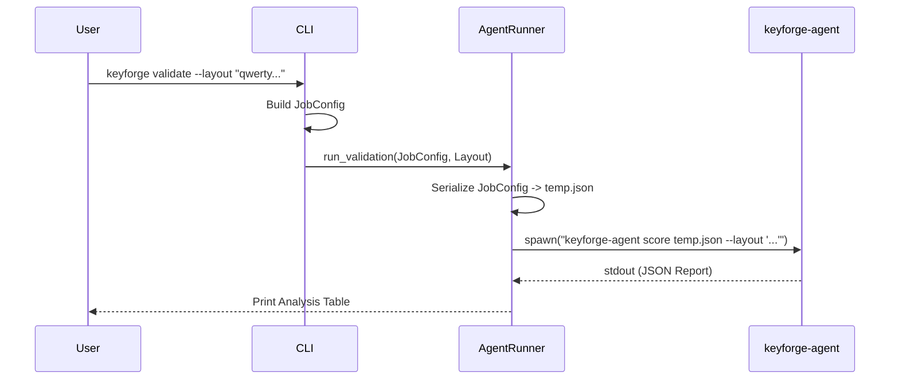
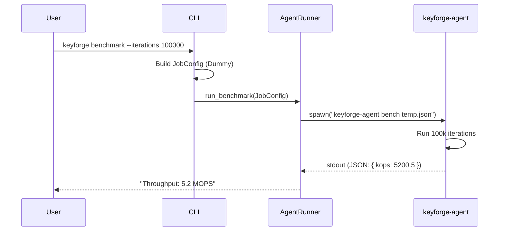
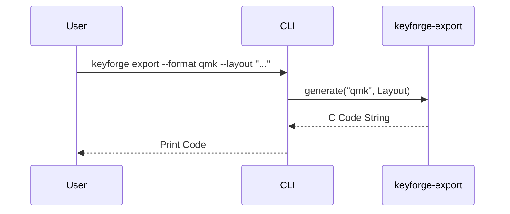
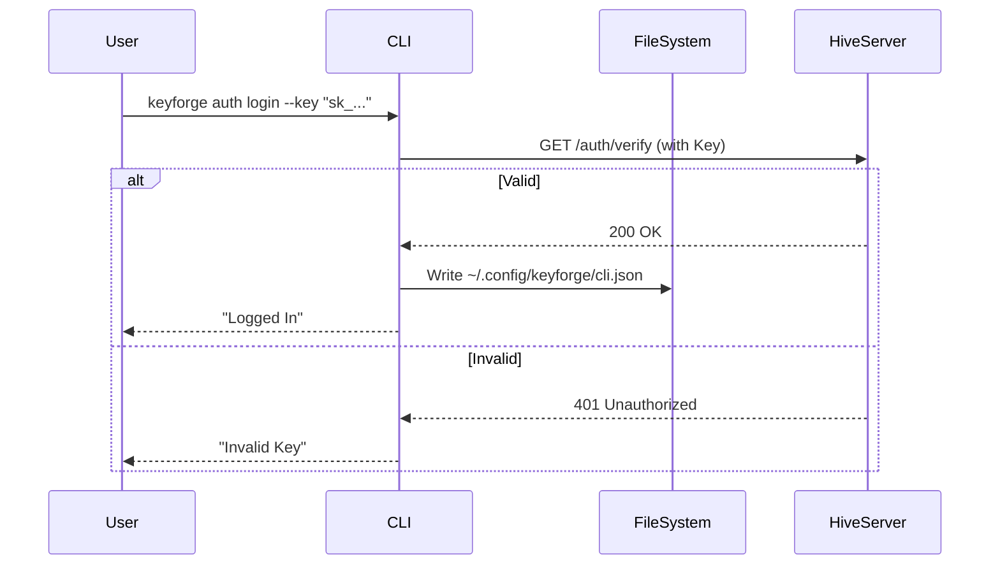
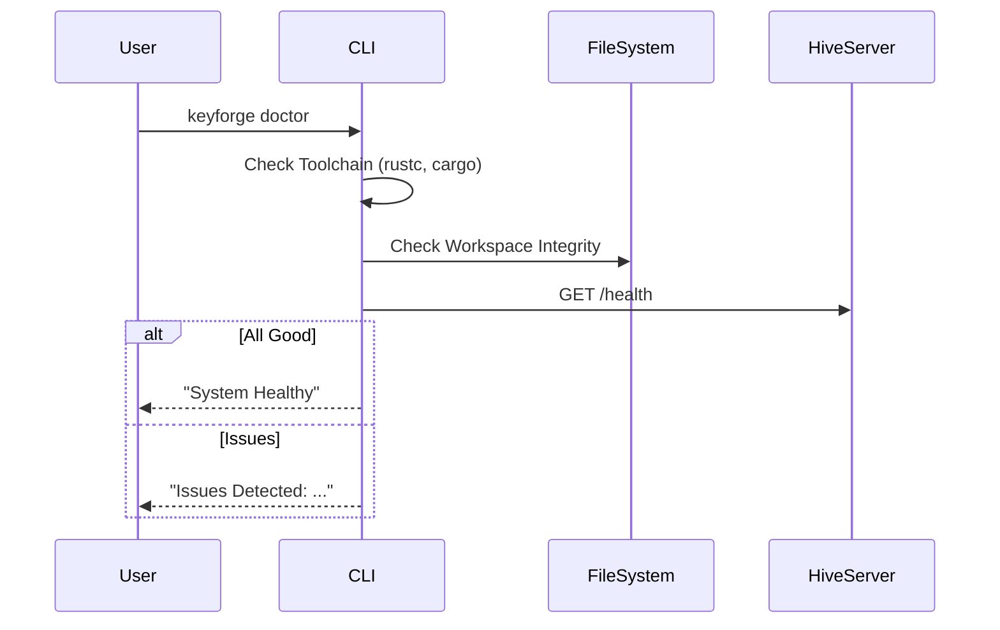

# Design: KeyForge CLI

**Responsibility:** Local development, asset management, and Agent orchestration.
**Tier:** 3 (The Driver)

## 1. The Thin Client Architecture

The CLI has been refactored into a "Thin Client" that delegates heavy computation to the `keyforge-agent`. This separation ensures a consistent execution environment for optimization jobs, whether run locally or on the remote Hive cluster.

### Responsibilities

1. **Asset Management (Native):**
   * The CLI directly manages the local workspace (`data/`) using `keyforge-infra`.
   * It handles downloading assets (`fetch`), initializing workspaces (`init`), and managing user identity (`auth`).
   * **Why?** These are IO-bound operations that do not require the Physics Engine.

2. **Job Orchestration (Delegated):**
   * For CPU-intensive tasks (`search`, `benchmark`, `validate`), the CLI acts as a driver.
   * It constructs a `JobConfig` from command-line arguments.
   * It spawns a `keyforge-agent` subprocess in "One-Shot" mode (`keyforge-agent run`).
   * It streams the agent's output to the console for real-time feedback.

## 2. Command Reference

### A. Init Command

Bootstraps the local workspace (`data/`) and downloads essential assets from the Hive.

### B. Fetch Command

Downloads specific assets (Keyboards, Corpora, Cost Matrices) from the Hive.

### C. Search Command (Delegated)

Runs a Simulated Annealing optimization loop via the Agent sidecar.

### D. Validate Command (Delegated)

Scores a specific layout string against a rubric via the Agent sidecar.

### E. Benchmark Command (Delegated)

Measures the IPS (Iterations Per Second) of the engine on the local hardware.

### F. Export Command

Generates firmware configuration files (QMK, ZMK) from a layout.

### G. Auth Command

Manages user identity and API keys.

### H. Doctor Command

Diagnoses system health and connectivity.

