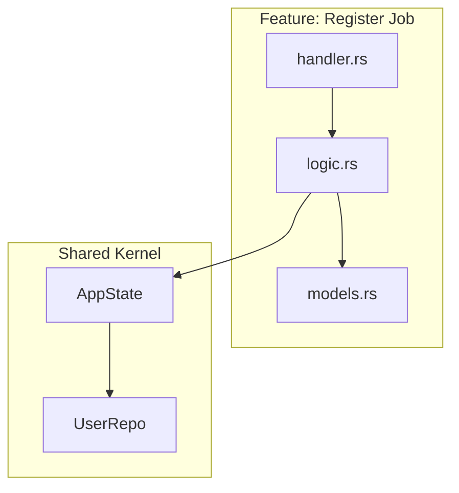
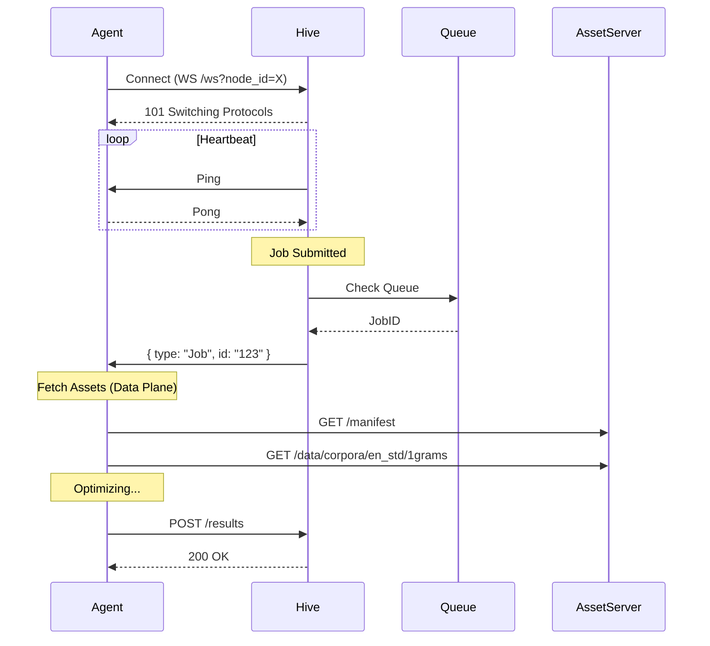

# Design: KeyForge Hive

**Responsibility:** Job orchestration, API hosting, and State management.
**Tier:** 3 (The Shell)

## 1. Vertical Slice Architecture

Each feature is self-contained in `src/features/<name>`.

## 2. The Worker Protocol (WebSocket)

Hive manages the *Work* distribution, not the *Data* distribution.

## 3. Scope Boundaries

| In Scope (Hive) | Out of Scope (Assets) |
| :--- | :--- |
| Job Queue Management | Serving 50MB corpus files |
| User Authentication | Asset Hashing / Integrity |
| Result Verification | System Config Distribution |
| Node Registry | |
