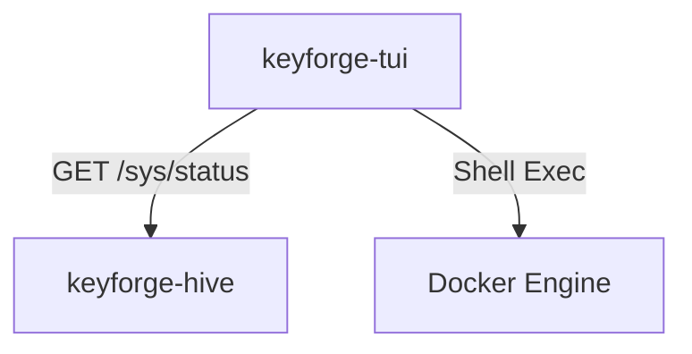

# Design: KeyForge TUI

**Responsibility:** Real-time cluster monitoring and admin console.
**Tier:** 3 (The Driver)
**Tech Stack:** Ratatui, Crossterm, Reqwest.

## 1. Purpose

`keyforge-tui` is a standalone Terminal User Interface application designed for administrators to monitor the health and performance of a KeyForge cluster. It provides a live dashboard of system metrics, active jobs, and log events.

## 2. Architecture: The External Monitor

The TUI acts as a high-level client to the `keyforge-hive` control plane. It is decoupled from the server binary to allow remote monitoring without requiring SSH access to the host machine (provided the Hive API is reachable).

### Data Sources

1.  **Hive API (`/sys/status`):** Fetches aggregate cluster metrics, node counts, and recent logs.
2.  **Local Docker Daemon:** Executes `docker ps` and `docker stats` to monitor the health of local containers (Hive, DB, Web, etc.).

## 3. Component Map

## 4. UI Layout

The interface is divided into several persistent zones:

| Zone | Content |
| :--- | :--- |
| **Header** | App Title and Host Uptime. |
| **Status Bar** | Connection status to the Hive server. |
| **Cluster State** | Table showing Active Jobs, Total Results, and Nodes Online. |
| **Containers** | Real-time RAM/CPU usage for Docker services. |
| **Logs** | Scrollable view of WARN and ERROR level events from the cluster. |

## 5. Implementation Details

*   **Non-blocking Refresh:** Docker metrics are fetched in a background thread to prevent the TUI event loop from lagging during heavy IO.
*   **Graceful Termination:** Handles `SIGINT` and `q` keypress to restore terminal state (raw mode, alternate screen) before exiting.
*   **Security:** Supports `HIVE_SECRET` for authenticated requests to protected management endpoints.

## 6. Dependencies

*   **`keyforge-protocol`**: For `SystemMetrics` and `LogEntry` DTOs.
*   **`keyforge-infra`**: Uses `HiveClient` for communication.
*   **`ratatui`**: Terminal rendering engine.
*   **`crossterm`**: Terminal backend.
