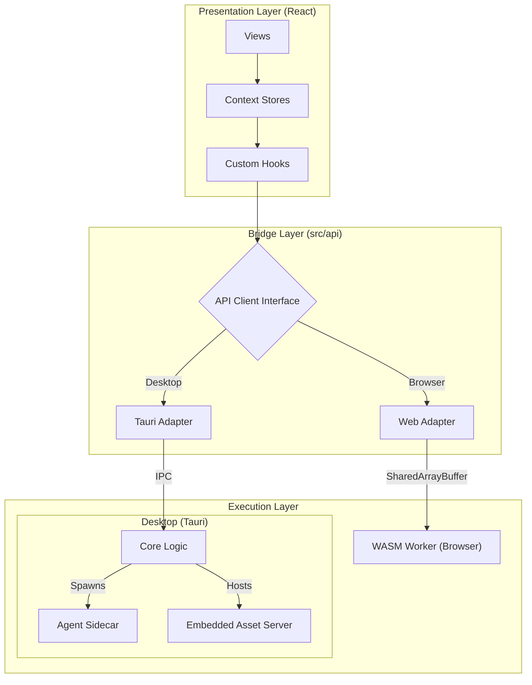

# Design: KeyForge UI

**Responsibility:** User Interaction, Visualization, and Client-Side Analysis.
**Tier:** 3 (The Driver)
**Tech Stack:** React, TypeScript, Vite, Tauri, TailwindCSS.

## 1. The Hybrid Runtime Architecture

KeyForge UI is designed to run in two distinct environments using a **Bridge Adapter Pattern**. This allows the same frontend code to power both the Desktop App (High Performance) and the Web Demo (High Accessibility).

In the **Desktop** environment, the application acts as an orchestrator, spawning a dedicated `keyforge-agent` sidecar (managed by `AgentRunner`) for compute-intensive tasks and hosting an embedded `keyforge-assets` server for local data serving.



## 2. State Management (Domain Contexts)

We avoid a monolithic global store (like Redux) in favor of **Domain-Bounded Contexts**. This aligns with the Hexagonal Architecture of the backend.

| Context | Domain | Responsibility |
| :--- | :--- | :--- |
| `SystemContext` | **App Lifecycle** | Theme, Toast notifications, Error boundaries. |
| `BackendContext` | **Connectivity** | Manages the `API Client` instance (Tauri vs Web) and connection status. |
| `LibraryContext` | **Persistence** | CRUD operations for Layouts, Corpora, and Results. |
| `AnalysisContext` | **Physics** | Real-time scoring, Heatmaps, and Metric reports. |
| `ArenaContext` | **Evolution** | Manages the "Arena" view where layouts battle (Genetic Algorithm visualization). |
| `SessionContext` | **User** | User authentication and preferences. |

## 3. The Bridge Pattern (`src/api`)

The application never calls `invoke()` or `fetch()` directly. It uses a typed `ApiClient` interface.

### Interface Definition

```typescript
export interface ApiClient {
  // Core Physics
  analyzeLayout(layout: Layout): Promise<AnalysisReport>;
  
  // Optimization
  startJob(config: JobConfig): Promise<JobId>;
  stopJob(id: JobId): Promise<void>;
  
  // System
  getSystemMetrics(): Promise<SystemMetrics>;
}
```

### Implementations

1. **`tauri.ts`**: Proxies calls to the Rust backend via Tauri IPC.
    * *Pros:* Native performance, File System access, Multi-threading.
2. **`web.ts`**: Proxies calls to `keyforge-wasm` running in a Web Worker.
    * *Pros:* Zero-install, Sandboxed.
    * *Cons:* Single-threaded (mostly), Memory limits.

## 4. Type Synchronization

To ensure the "Semantic Firewall" extends to the frontend, we generate TypeScript definitions directly from Rust structs.

* **Source:** `libs/keyforge-protocol/src/dto.rs`
* **Tool:** `ts-rs` (or similar generation script).
* **Destination:** `apps/keyforge-ui/src/types/generated/`

**Invariant:** If the Rust backend changes a DTO, the Frontend build MUST fail until updated.

## 5. Visualization Components

* **`KeyboardMap`**: A dynamic SVG renderer that visualizes `KeyNode` spatial data. It supports overlays for Heatmaps, Finger Usage, and SFBs.
* **`LiveGraph`**: Real-time plotting of the Annealing temperature and score deltas.
* **`ArenaCanvas`**: A WebGL/Canvas view for visualizing high-frequency layout mutations during optimization.
