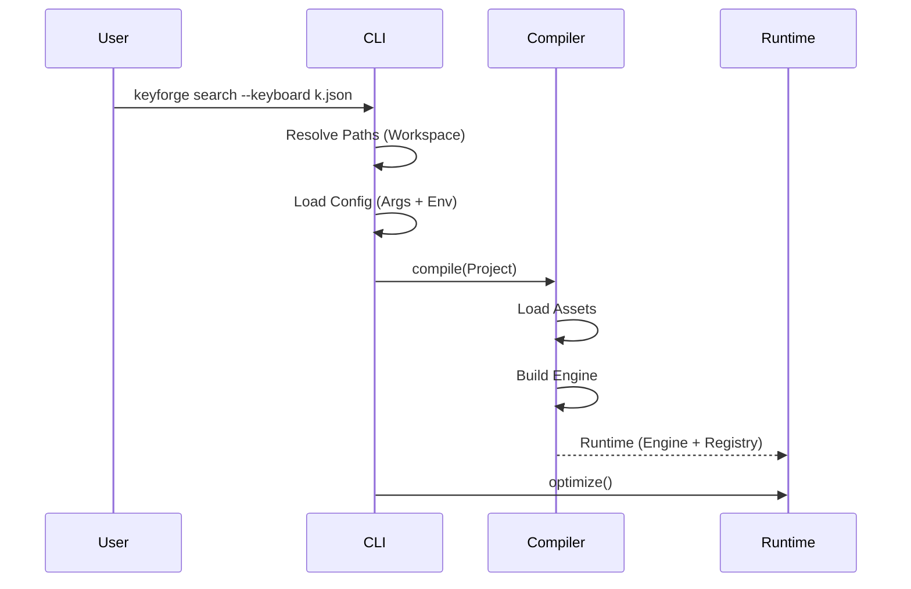

# Design: KeyForge CLI

**Responsibility:** Local development and analysis tool.
**Tier:** 3 (The Driver)

## 1. Command Structure

The CLI uses `clap` subcommands to route execution.

* **Stateless Commands:** `init`, `fmt`, `list`. Do not require a compiled engine.
* **Runtime Commands:** `search`, `validate`, `benchmark`. Require `keyforge-compute`.

## 2. The Runtime Builder

