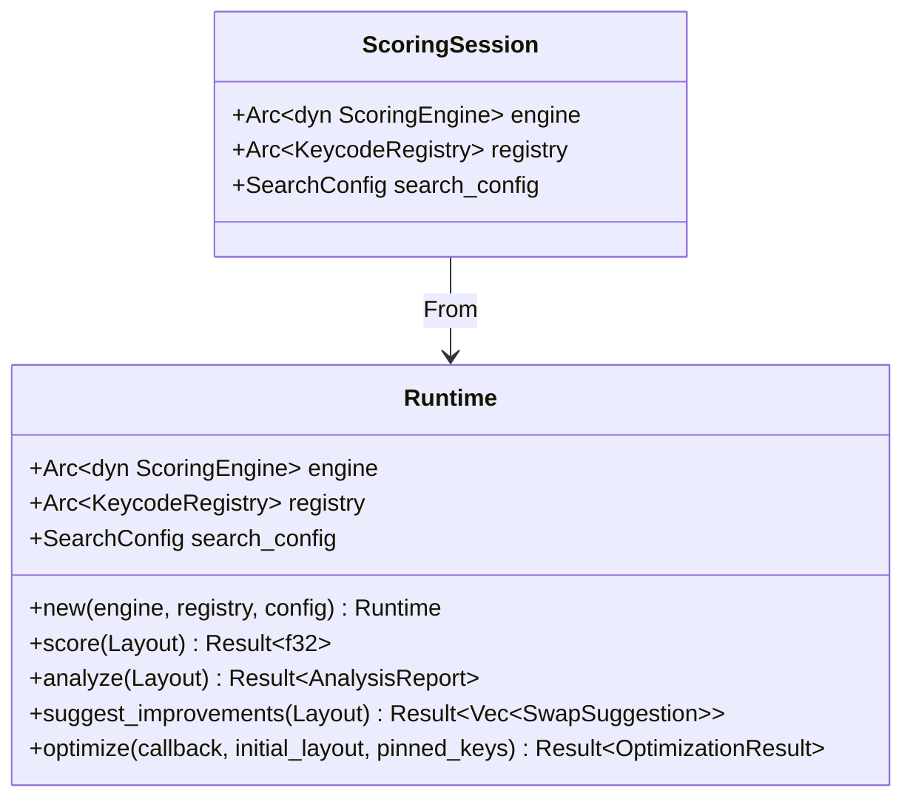
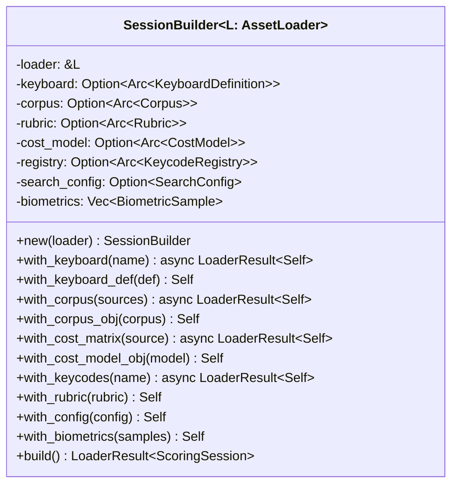
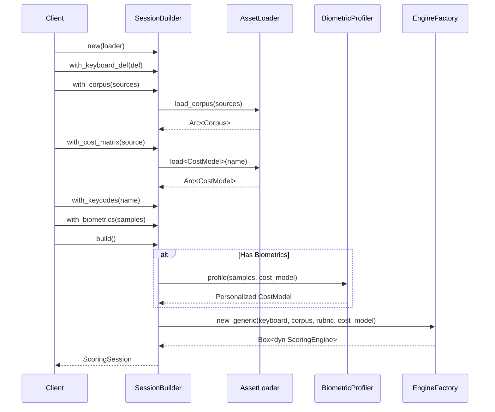
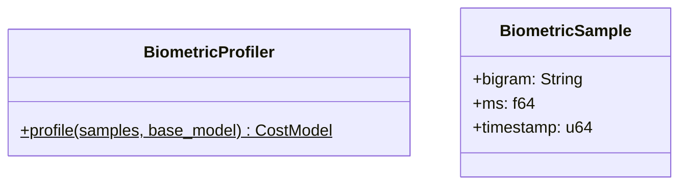
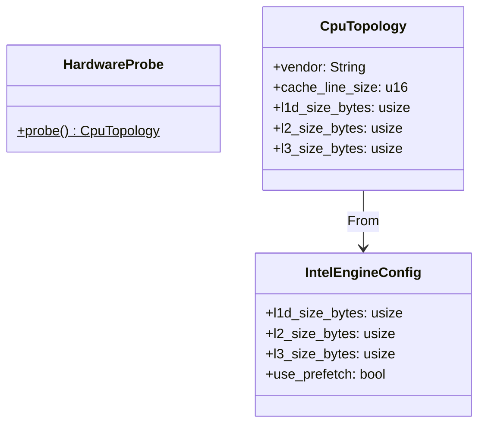

# Design: KeyForge Compute

**Responsibility:** Application Service for local execution.
**Tier:** 2 (The Glue)

## 1. The Runtime Aggregate

The `Runtime` struct is the primary entry point for clients (CLI, GUI) that want to execute physics operations. It bundles the stateless `ScoringEngine` with the stateful `SearchConfig` and `KeycodeRegistry`.



`Runtime` can be constructed from a `ScoringSession` via `From` trait.

## 2. Session Builder

The `SessionBuilder` constructs a `ScoringSession` from raw inputs using async asset loading.



### Build Sequence



## 3. Biometric Profiler

Transforms raw typing latency samples into personalized cost model adjustments:



**Algorithm:**
1. Group samples by bigram
2. Calculate average latency per bigram
3. Compute median latency as normalization baseline
4. Map to `sequence_modifiers` in dynamic rules (requires ≥5 samples per bigram)

## 4. Hardware Detection

CPU topology detection for selecting optimized engine implementations:



`HardwareProbe::probe()` uses `raw-cpuid` to detect:
- Vendor (Intel/AMD)
- L1D, L2, L3 cache sizes
- Cache line size

This info feeds into `IntelEngineConfig` for cache-aware blocking in the optimized engine.

## 5. Module Structure

```
keyforge-compute/src/
├── biometrics.rs  # BiometricProfiler
├── builder.rs     # SessionBuilder
├── hardware.rs    # HardwareProbe, CpuTopology
└── lib.rs         # Runtime, exports
```

## 6. Dependencies

| Crate | Purpose |
|-------|---------|
| `keyforge-core` | `ScoringSession`, `AssetLoader`, `ProgressCallback` |
| `keyforge-physics` | `ScoringEngine`, `EngineFactory`, `IntelEngineConfig` |
| `keyforge-model` | Domain types |
| `keyforge-protocol` | `BiometricSample` DTO |
| `raw-cpuid` | CPU feature detection |
