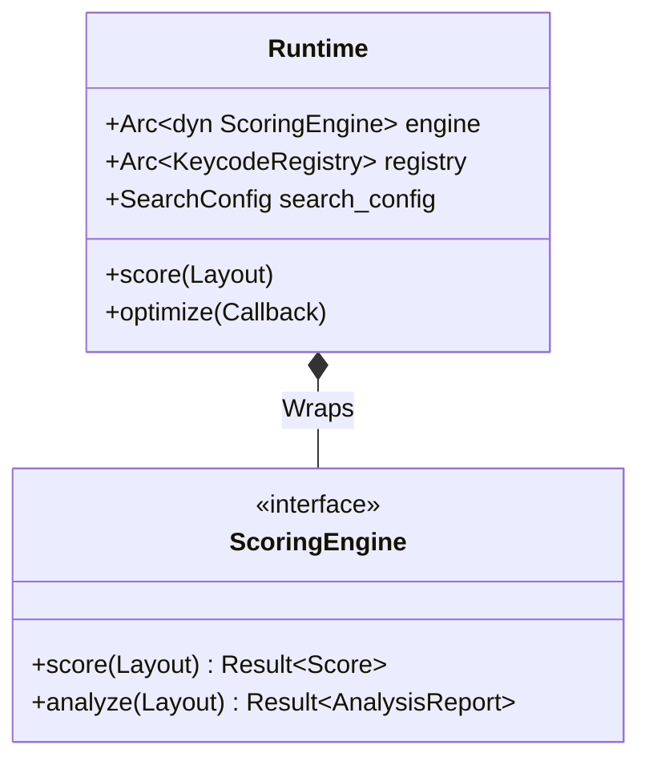
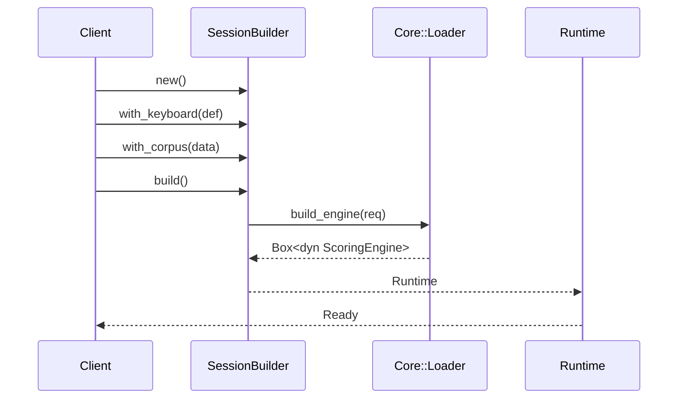

# Design: KeyForge Compute

**Responsibility:** Application Service for local execution.
**Tier:** 2 (The Glue)

## 1. The Runtime Aggregate

The `Runtime` struct is the primary entry point for clients (CLI, GUI) that want to execute physics operations. It bundles the stateless `ScoringEngine` with the stateful `SearchConfig` and `KeycodeRegistry`.

## 2. Session Builder

The `SessionBuilder` (or `Compiler` in persistence) constructs a `Runtime` from raw inputs.

