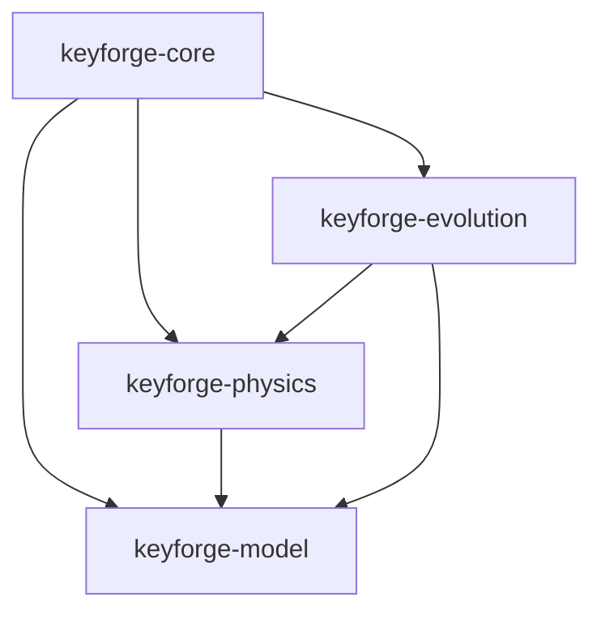
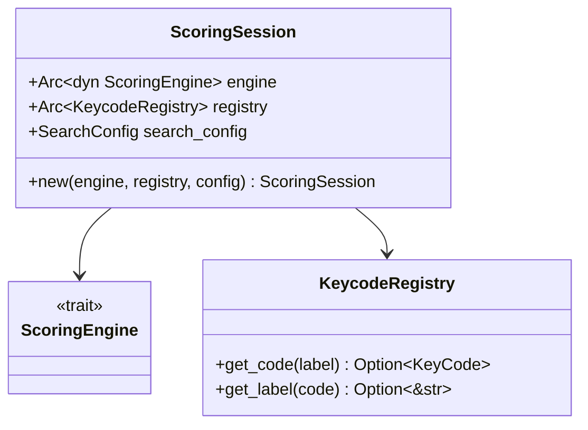
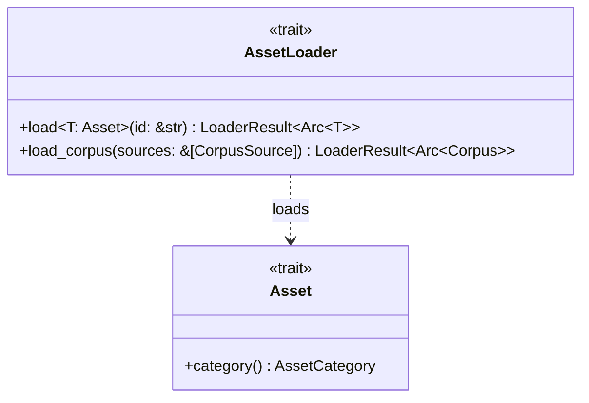
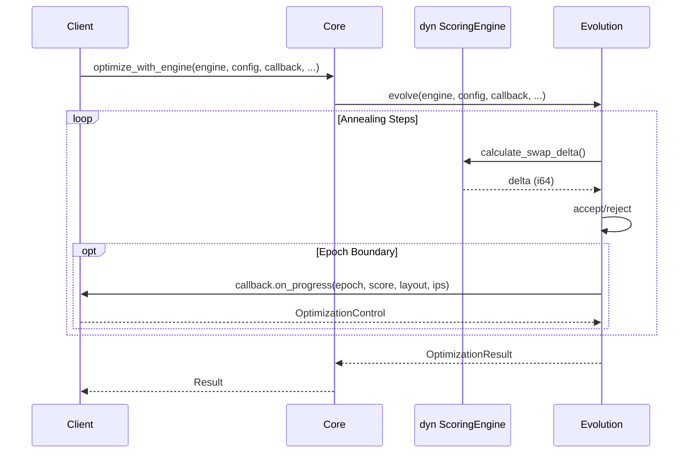

# Design: KeyForge Core

**Responsibility:** Pure orchestration and helper functions.
**Tier:** 2 (The Glue)
**Constraint:** NO IO allowed. This crate must compile to WASM.

## 1. Overview

`keyforge-core` exists to prevent circular dependencies between `physics`, `evolution`, and `model`. It provides high-level functions that coordinate these lower-level crates without being tied to IO or protocols.



## 2. Public API

### Engine-Based Functions (Preferred)

Use these when you have a pre-compiled `ScoringEngine`:

| Function | Purpose |
|----------|---------|
| `build_engine(EngineRequest)` | Compile a new `ScoringEngine` |
| `score_with_engine(engine, layout)` | Score a layout → `f32` |
| `analyze_with_engine(engine, layout)` | Analyze a layout → `AnalysisReport` |
| `suggest_with_engine(engine, layout)` | Get swap suggestions |
| `optimize_with_engine(engine, config, callback, ...)` | Run optimization |
| `identify(layout)` | Match to known layout (Qwerty, etc.) |

### Request-Based Functions (Legacy)

These compile an engine internally from an `EngineRequest`:

| Function | Purpose |
|----------|---------|
| `score(EngineRequest)` | Score → `OptimizationResult` |
| `analyze(EngineRequest)` | Analyze → `AnalysisReport` |
| `suggest(EngineRequest)` | Suggest swaps |
| `optimize(EngineRequest)` | Optimize without callback |
| `optimize_with_callback(EngineRequest, CB)` | Optimize with progress |

## 3. ScoringSession

A consolidated environment holding a compiled engine with metadata:



## 4. AssetLoader Trait

The IO abstraction allowing core to remain filesystem/network agnostic:



Implementations live in `keyforge-infra` (filesystem) and `keyforge-wasm` (in-memory).

## 5. Optimization Flow



## 6. Re-exports

For convenience, `keyforge-core` re-exports commonly used types:

| From | Types |
|------|-------|
| `keyforge-evolution` | `EvolutionError`, `ProgressCallback` |
| `keyforge-physics` | `ScoringEngine`, `PhysicsError`, `EngineRequest`, `LayoutIdentity`, `DeterministicScorer` |

## 7. Module Structure

```
keyforge-core/src/
├── loader.rs    # AssetLoader trait, LoaderResult
├── session.rs   # ScoringSession
└── lib.rs       # Public API functions, re-exports
```
