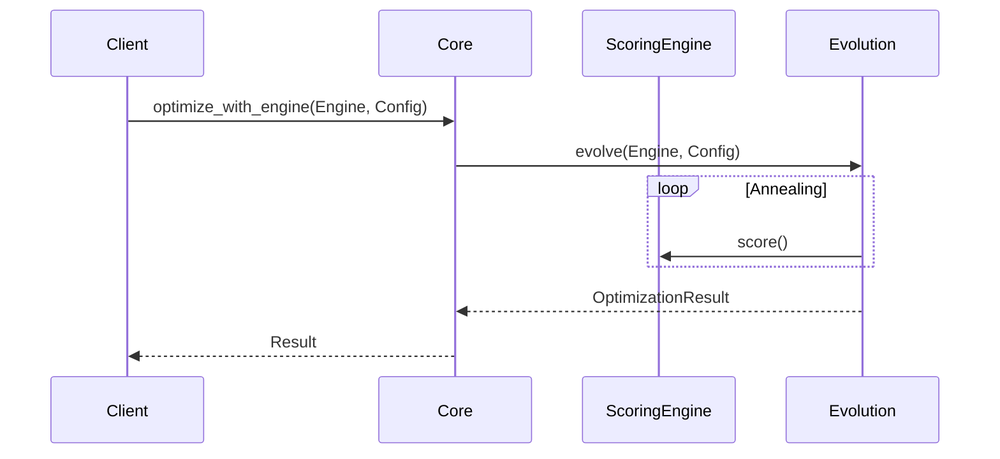

# Design: KeyForge Core

**Responsibility:** Pure orchestration and helper functions.
**Tier:** 2 (The Glue)

## 1. Orchestration Layer

`keyforge-core` exists to prevent circular dependencies between `physics`, `evolution`, and `model`. It provides high-level functions that coordinate these lower-level crates.

* **Constraint:** NO IO allowed. This crate must compile to WASM.

## 2. Optimization Flow

