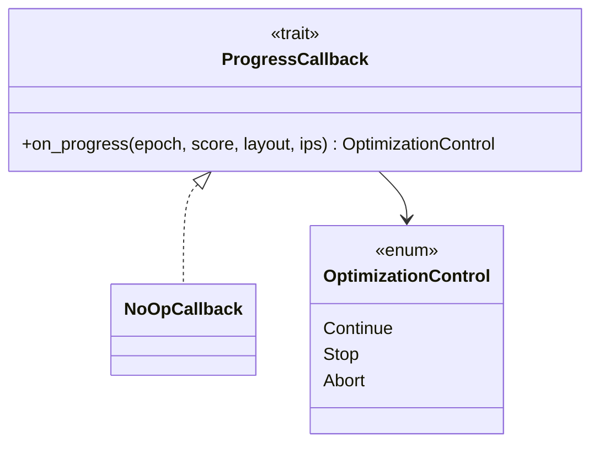
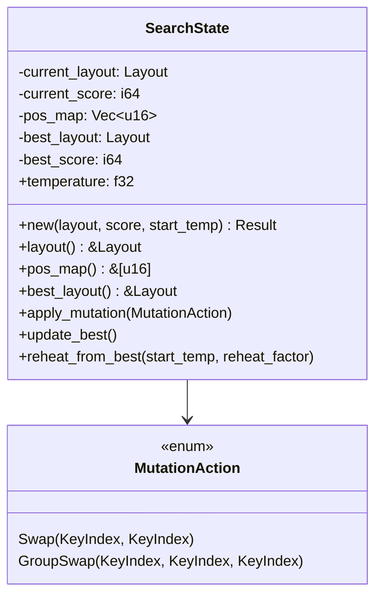
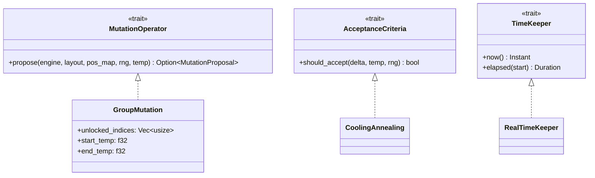
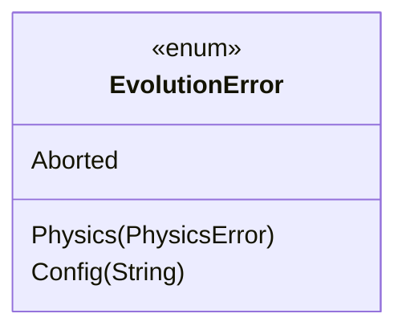

# Design: KeyForge Evolution

**Responsibility:** Stochastic optimization (Simulated Annealing).
**Tier:** 1 (The Nucleus)

## 1. Public API

The crate exposes three entry points for optimization:

| Function | Purpose |
|----------|---------|
| `optimize(EngineRequest)` | Basic optimization with no callback |
| `optimize_with_callback(EngineRequest, CB)` | Optimization with progress reporting |
| `evolve(engine, config, callback, initial_layout, pinned_keys)` | Low-level API using pre-compiled engine |

## 2. Progress Callback

Clients receive progress updates via the `ProgressCallback` trait:



The callback returns `OptimizationControl` to allow graceful stopping or immediate abort.

## 3. The Annealing Loop

The `Optimizer` drives the search for the global minimum using configurable strategies.

```mermaid
sequenceDiagram
    participant Opt as Optimizer
    participant State as SearchState
    participant Mut as MutationOperator
    participant Acc as AcceptanceCriteria
    participant Eng as dyn ScoringEngine
    participant CB as ProgressCallback

    Opt->>Eng: score(initial_layout)
    Eng-->>Opt: initial_score
    Opt->>State: new(layout, score, start_temp)
    
    loop Steps
        Mut->>Eng: calculate_swap_delta(layout, pos_map, a, b)
        Eng-->>Mut: delta (i64)
        Mut-->>Opt: MutationProposal { delta, action }
        
        alt delta < 0 (Improvement)
            Opt->>State: apply_mutation(action)
            Opt->>State: update_best()
        else delta >= 0 (Degradation)
            Opt->>Acc: should_accept(delta, temp, rng)
            alt Accepted
                Opt->>State: apply_mutation(action)
            end
        end
        
        Opt->>State: temperature *= cooling_factor
        
        opt Patience Exceeded
            Opt->>State: reheat_from_best(start_temp, reheat_factor)
        end

        opt Epoch Boundary
            Opt->>CB: on_progress(epoch, score, layout, ips)
            CB-->>Opt: OptimizationControl
        end
    end

    Opt-->>Opt: return best_layout
```

## 4. Search State

The `SearchState` maintains current and best layouts with an optimized position map (`pos_map`) for O(1) key lookups:



## 5. Strategy Traits

The optimizer is parameterized by pluggable strategies:



### Built-in Strategies

| Strategy | Type | Description |
|----------|------|-------------|
| `GroupMutation` | Mutation | Swaps keys within unlocked indices; scales mutation size with temperature |
| `CoolingAnnealing` | Acceptance | Boltzmann probability: `exp(-delta / temp)` |
| `RealTimeKeeper` | Time | System clock (replaceable for deterministic tests) |

## 6. Configuration

Annealing parameters come from `SearchConfig::Annealing`:

| Parameter | Purpose |
|-----------|---------|
| `steps` | Total optimization iterations |
| `start_temp` | Initial temperature |
| `end_temp` | Final temperature |
| `seed` | RNG seed for reproducibility |
| `patience` | Steps without improvement before reheat |
| `reheats` | Maximum number of reheats |
| `reheat_factor` | Temperature multiplier on reheat |

## 7. Error Handling



## 8. Module Structure

```
keyforge-evolution/src/
├── supervisor/
│   ├── strategies/
│   │   ├── annealing.rs   # CoolingAnnealing
│   │   ├── group.rs       # GroupMutation
│   │   └── scratch.rs     # Experimental strategies
│   ├── annealing.rs       # Optimizer, AnnealingConfig
│   ├── optimizer.rs       # evolve(), optimize() entry points
│   ├── state.rs           # SearchState
│   └── traits.rs          # MutationOperator, AcceptanceCriteria, TimeKeeper
├── errors.rs              # EvolutionError
└── lib.rs                 # Public exports, ProgressCallback
```
