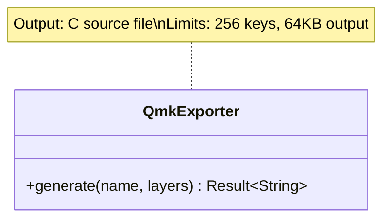
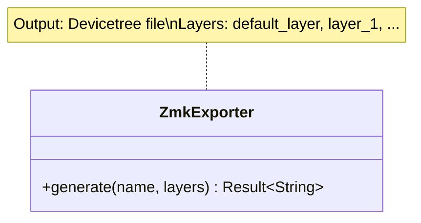
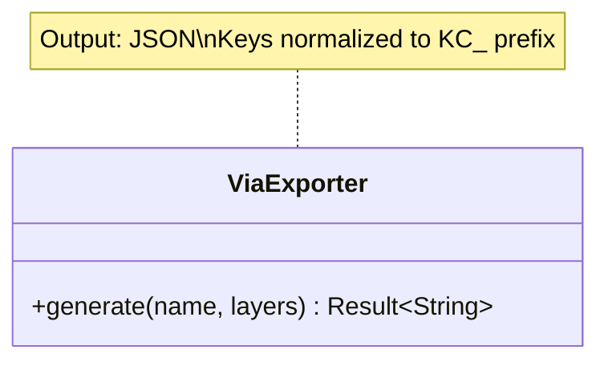

# Design: KeyForge Export

**Responsibility:** Generating firmware configuration files and visualizations.
**Tier:** 3 (The Adapter)

## 1. Exporter Trait

A Strategy pattern for different firmware targets supporting multiple layers:

```rust
pub trait Exporter {
    fn generate(&self, layout_name: &str, layers: &[Vec<String>]) -> Result<String>;
}
```

## 2. Supported Targets

### QmkExporter

Generates `keymap.c` arrays for QMK firmware.



**Output format:**
```c
#include QMK_KEYBOARD_H

const uint16_t PROGMEM keymaps[][MATRIX_ROWS][MATRIX_COLS] = {
  [0] = LAYOUT(
    KC_A, KC_B, ...
  ),
  [1] = LAYOUT(
    _______, XXXXXXX, ...
  ),
};
```

### ZmkExporter

Generates `.keymap` devicetree overlays for ZMK firmware.



**Output format:**
```dts
/ {
    keymap {
        compatible = "zmk,keymap";
        
        default_layer {
            bindings = <
                &kp A &kp B ...
            >;
        };
        layer_1 {
            bindings = <
                &trans &none ...
            >;
        };
    };
};
```

### ViaExporter

Generates JSON for VIA keyboard configurator.



**Output format:**
```json
{
  "name": "My Layout",
  "layers": [
    ["KC_A", "KC_B", ...],
    ["KC_TRNS", "KC_NO", ...]
  ]
}
```

## 3. KeyAction Handling

The exporters parse key strings via `keyforge-adapter::parsing::parse_key()` and convert to firmware-specific syntax:

| KeyAction | QMK Output | ZMK Output |
|-----------|------------|------------|
| `Simple("A")` | `KC_A` | `&kp A` |
| `Transparent` | `_______` | `&trans` |
| `NoOp` | `XXXXXXX` | `&none` |
| `LayerMomentary(1)` | `MO(1)` | `&mo 1` |
| `LayerToggle(2)` | `TG(2)` | `&tog 2` |
| `LayerOn(3)` | `TO(3)` | `&to 3` |
| `ModTap(LSFT, Z)` | `LSFT_T(Z)` | `&mt LSHIFT Z` |
| `LayerTap(1, SPC)` | `LT(1, SPC)` | `&lt 1 SPC` |
| `StickyMod(LCTL)` | `OSM(MOD_LCTL)` | `&sk LCTRL` |
| `CapsWord` | `CAPS_WORD` | `&caps_word` |

## 4. Visualization

### Physics SVG Generator

Generates SVG visualization of keyboard geometry:

```rust
pub fn generate_physics_svg(geo: &KeyboardGeometry) -> String;
```

- Auto-calculates bounding box from key positions
- Highlights home row keys
- Renders key labels
- Outputs responsive SVG with viewBox

## 5. Utilities

### Modifier Mapping

```rust
pub enum ModFormat { Qmk, Zmk }
pub fn map_modifier(name: &str, format: ModFormat) -> String;
```

| Input | QMK | ZMK |
|-------|-----|-----|
| `LSFT` / `LSHIFT` | `MOD_LSFT` | `LSHIFT` |
| `LCTL` / `LCTRL` | `MOD_LCTL` | `LCTRL` |
| `LGUI` / `WIN` / `CMD` | `MOD_LGUI` | `LGUI` |

### Sanitization

| Function | Purpose | Example |
|----------|---------|---------|
| `sanitize_c(s)` | C identifier safe | `"Key(1)"` → `"Key_1"` |
| `sanitize_zmk(s)` | Devicetree safe | `"Key(1)"` → `"Key1"` |

## 6. Module Structure

```
keyforge-export/src/
├── viz/
│   ├── mod.rs
│   └── physics.rs    # generate_physics_svg()
├── lib.rs            # Exporter trait
├── qmk.rs            # QmkExporter
├── zmk.rs            # ZmkExporter
├── via.rs            # ViaExporter
└── util.rs           # map_modifier, sanitize_*
```

## 7. Safety Limits

| Exporter | Max Keys | Max Output Size |
|----------|----------|-----------------|
| QMK | 256 | 64 KB |
| ZMK | None | None |
| VIA | None | None |
