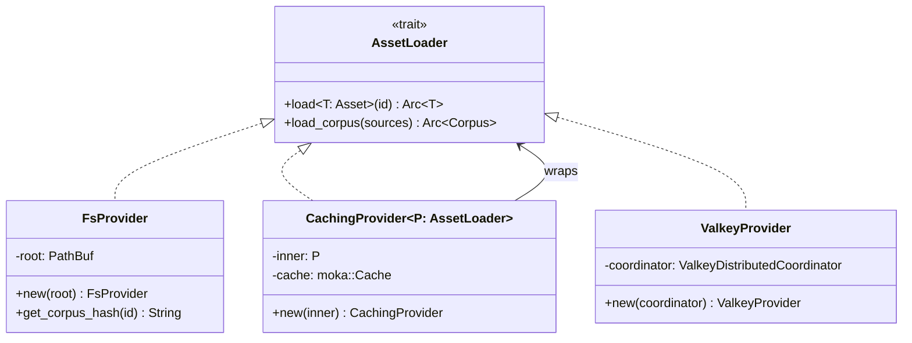
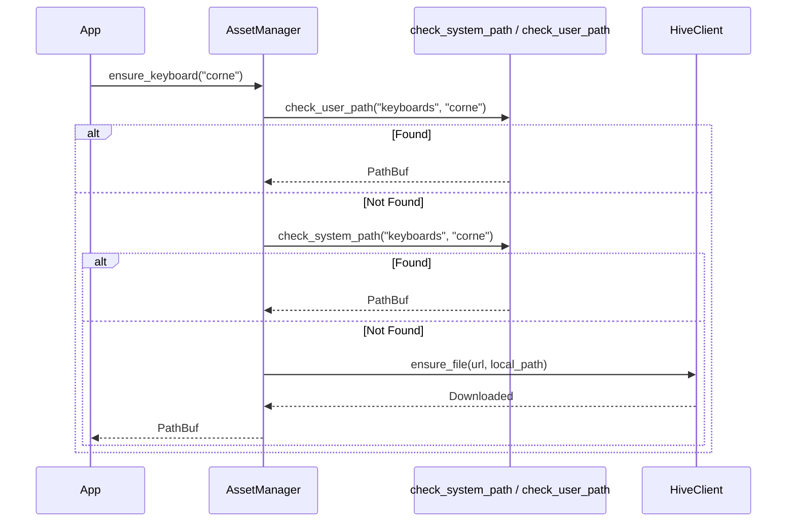
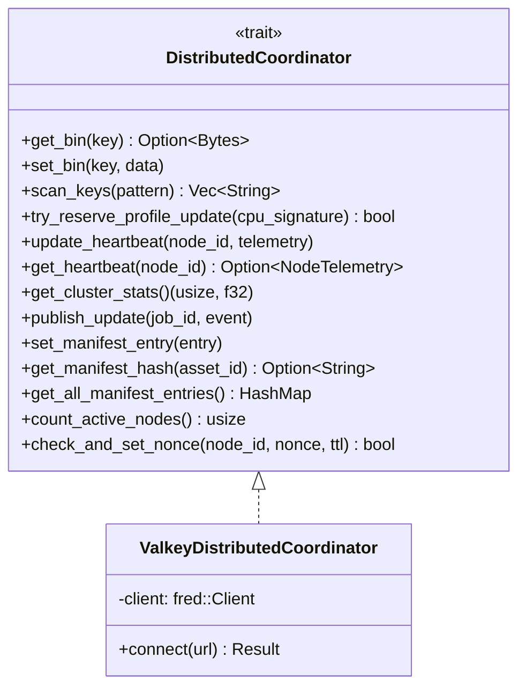
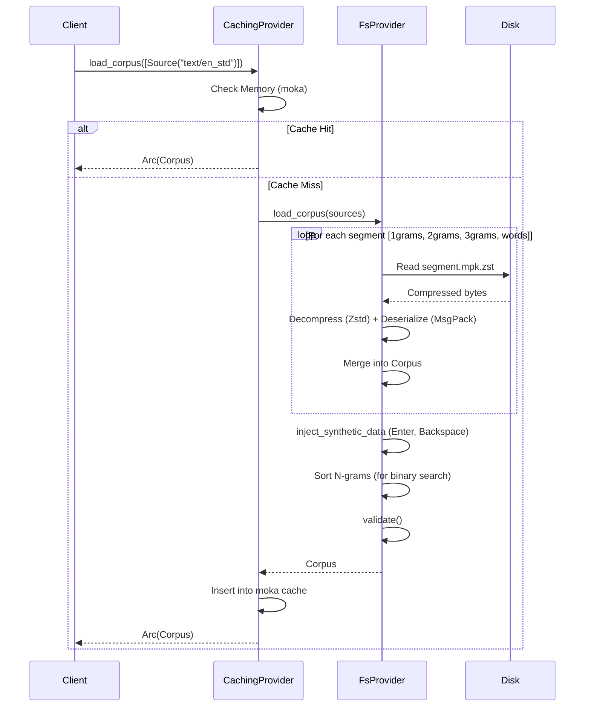
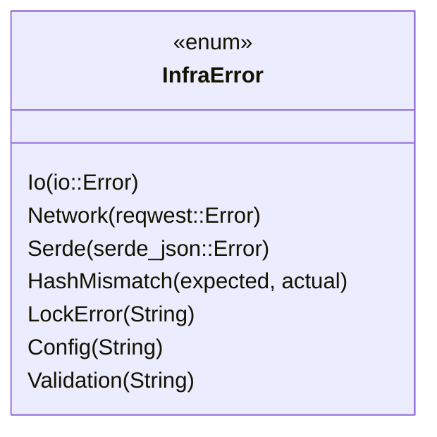

# Design: KeyForge Infra

**Responsibility:** IO Adapters (Filesystem, Network, Database, Distributed Coordination).
**Tier:** 3 (The Adapter)

## 1. Asset Providers

The crate implements the `AssetLoader` trait from `keyforge-core` with multiple backends:



## 2. Asset Manager

The `AssetManager` orchestrates local + remote asset resolution:



**Methods:**
- `ensure_keyboard(name)` - Ensure keyboard definition exists
- `ensure_cost_matrix(filename)` - Ensure cost matrix exists
- `ensure_corpus(corpus_id, expected_hash)` - Ensure corpus bundle exists
- `sync_job_assets(JobConfig)` - Sync all assets for a job

## 3. Distributed Coordinator

Trait for cluster-wide state management (heartbeats, manifests, pub/sub):



## 4. Corpus Loading Pipeline



## 5. Network Layer

### HiveClient

HTTP client for communicating with the control plane:

```rust
pub struct HiveClient {
    pub fn new(base_url, api_key) -> Self;
    pub fn asset_url(&self, path) -> String;
    // ... HTTP methods
}
```

### Sync Functions

| Function | Purpose |
|----------|---------|
| `bootstrap_essentials()` | Download minimum required assets |
| `generate_manifest()` | Generate local asset manifest |
| `run_sync()` | Full sync with remote server |
| `ensure_file(client, url, local, hash)` | Download single file |
| `ensure_corpus_bundle(...)` | Download corpus segments |
| `ensure_cost_matrix(...)` | Download cost matrix |

## 6. Filesystem Layer

### WorkspaceLock

Process-level exclusive lock using `fs2`:

```rust
pub struct WorkspaceLock {
    pub fn acquire(path) -> InfraResult<Self>;  // Exponential backoff retry
}
// Automatically releases on drop
```

### Utilities

| Function | Purpose |
|----------|---------|
| `initialize_workspace(root, mode)` | Create directory structure |
| `atomic_write(path, data)` | Write-then-rename for crash safety |
| `read_to_string_limited(path, limit)` | Bounded file read |
| `resolve_root()` | Find workspace root |
| `calculate_file_hash(path)` | SHA-256 hash |

### InitMode

```rust
pub enum InitMode {
    Create,    // Create if missing
    Verify,    // Check structure only
}
```

## 7. Error Handling



## 8. Module Structure

```
keyforge-infra/src/
├── asset/
│   ├── cache.rs           # Cache key generation
│   ├── caching_provider.rs # CachingProvider (moka)
│   ├── fs_provider.rs     # FsProvider (filesystem)
│   ├── manager.rs         # AssetManager
│   ├── resolver.rs        # Path resolution logic
│   └── valkey_provider.rs # ValkeyProvider
├── fs/
│   ├── init.rs            # initialize_workspace, InitMode
│   ├── io.rs              # atomic_write, read_to_string_limited
│   ├── listing.rs         # Directory listing utilities
│   ├── lock.rs            # WorkspaceLock
│   └── paths.rs           # resolve_root
├── net/
│   ├── client.rs          # HiveClient
│   ├── distributed.rs     # DistributedCoordinator, ValkeyDistributedCoordinator
│   ├── network.rs         # ensure_file, ensure_corpus_bundle
│   └── sync.rs            # bootstrap_essentials, run_sync, ServerManifest
├── util/
│   └── common.rs          # calculate_file_hash, sanitize_filename, etc.
├── config.rs              # Configuration structures
├── error.rs               # InfraError, InfraResult
└── lib.rs                 # Re-exports, get_build_info()
```

## 9. Build Info

Compile-time injected metadata:

```rust
pub fn get_build_info() -> (&'static str, &'static str) {
    (GIT_HASH, BUILD_DATE)
}
```
