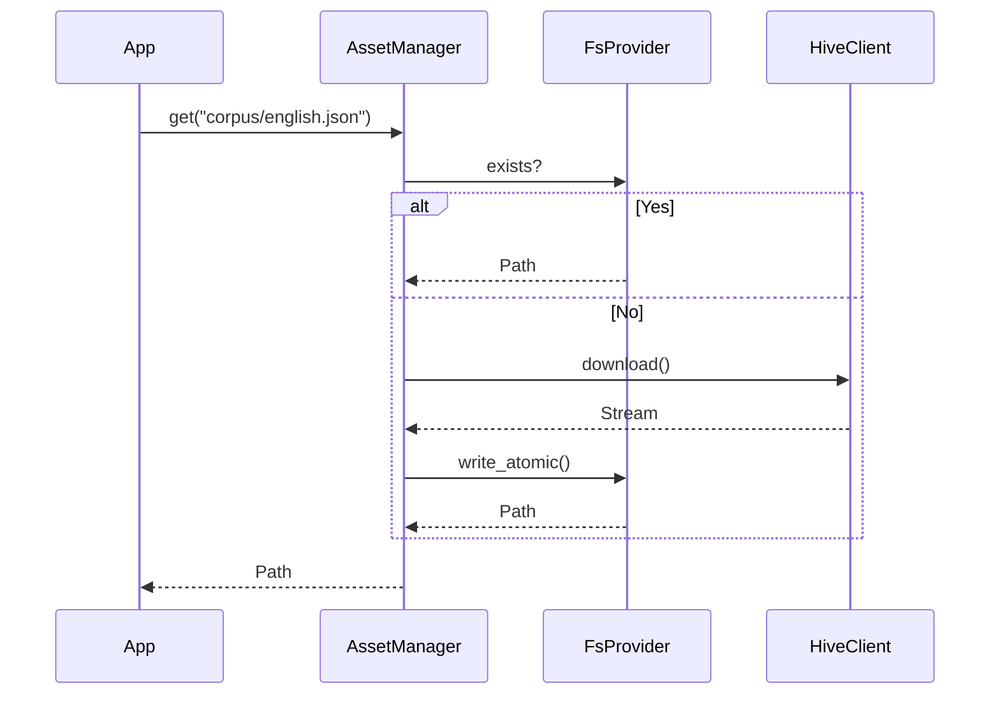

# Design: KeyForge Infra

**Responsibility:** IO Adapters (Filesystem, Network, Database).
**Tier:** 3 (The Adapter)

## 1. Asset Management

The `AssetManager` abstracts the difference between local files and remote resources.

## 2. Repository Pattern

Data access is hidden behind traits to allow swapping backends (e.g., SQLite -> Postgres).

* **UserRepo:** Manages User accounts and API keys.
* **JobRepo:** (Planned) Manages Job state and results.
