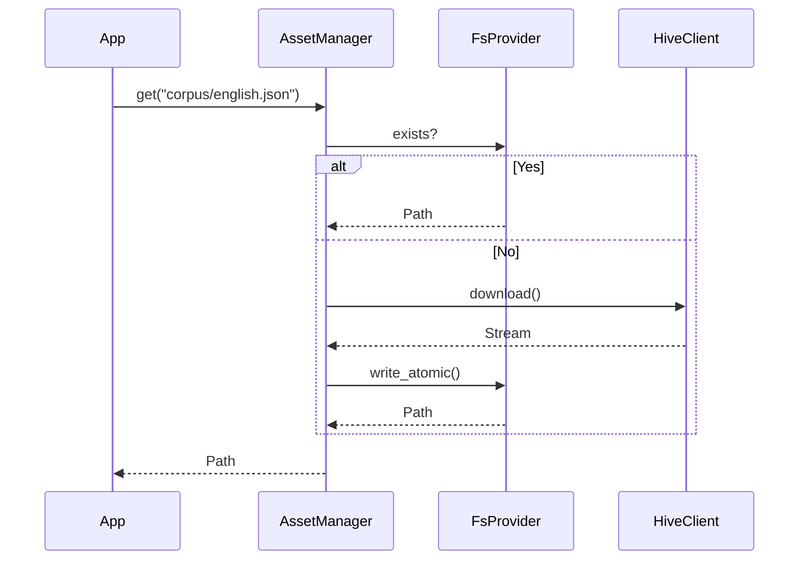
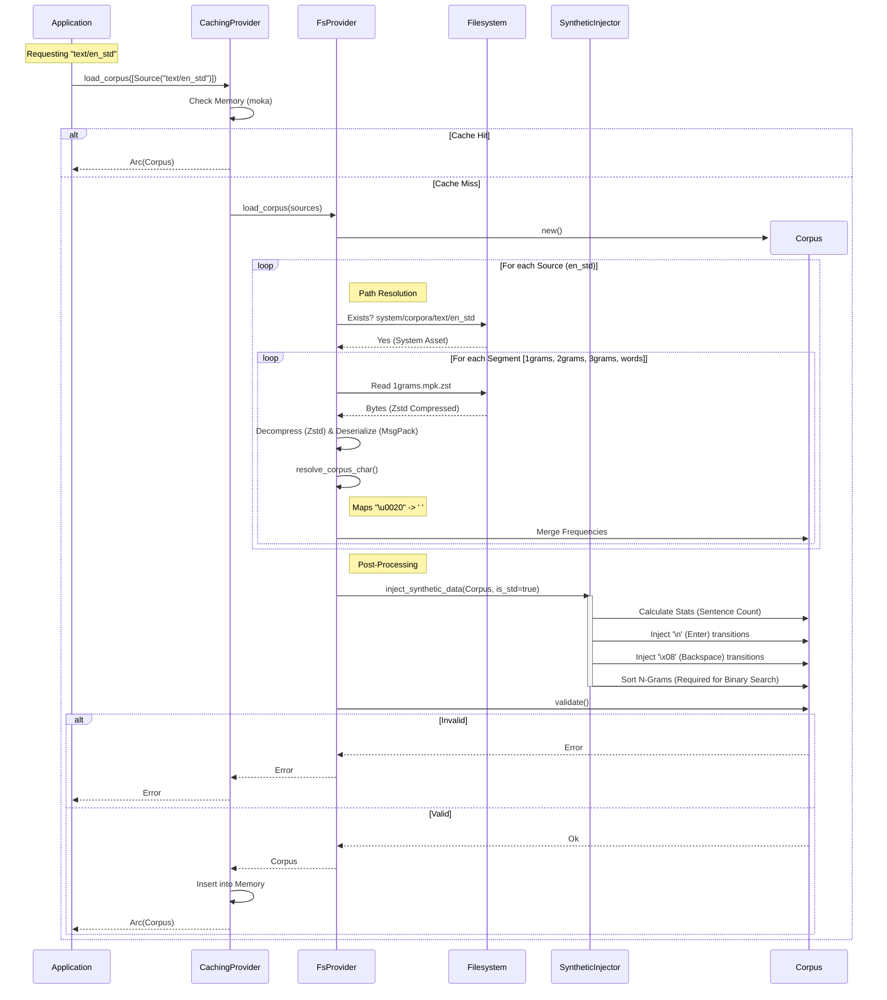

# Design: KeyForge Infra

**Responsibility:** IO Adapters (Filesystem, Network, Database).
**Tier:** 3 (The Adapter)

## 1. Asset Management

The `AssetManager` abstracts the difference between local files and remote resources.

## 2. Corpus Loading Pipeline

The loading of a standard corpus (e.g., `en_std`) involves a complex pipeline of caching, segmented file merging, and synthetic data injection.

### Key Steps

1. **Cache Check:** The `CachingProvider` checks if the specific combination of sources exists in memory.
2. **Path Resolution:** The `FsProvider` looks in `data/system/corpora` for binary assets (`.mpk.zst`) or `data/user/corpora` for JSON.
3. **Segmented Loading:** The corpus is assembled from `1grams`, `2grams`, `3grams`, and `words` files.
4. **Token Resolution:** String tokens (like `"\u0020"` or `"SPACE"`) are resolved to Rust `char` primitives.
5. **Synthetic Injection:** For standard prose (`_std`), **Enter** and **Backspace** frequencies are synthetically injected based on punctuation and error rate models.
6. **Sorting:** N-gram vectors are sorted to enable O(log n) binary search lookups in the Physics engine.

## 3. Repository Pattern

Data access is hidden behind traits to allow swapping backends (e.g., SQLite -> Postgres).

* **UserRepo:** Manages User accounts and API keys.
* **JobRepo:** (Planned) Manages Job state and results.
