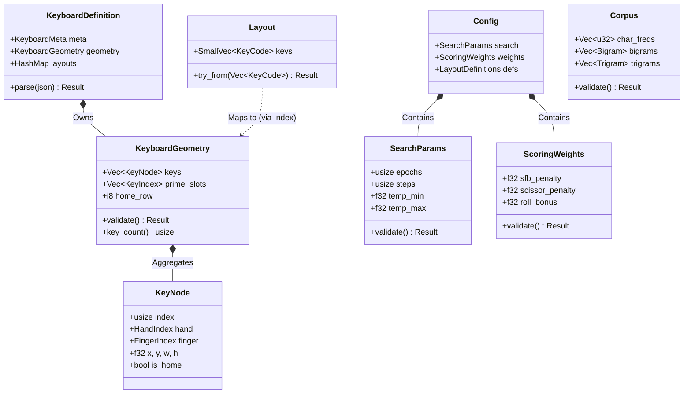

# Design: KeyForge Model

**Responsibility:** Domain Entities, Strong Types, and Business Logic.
**Tier:** 1 (The Nucleus)
**Dependencies:** Pure Rust (serde, postcard, thiserror).

## 1. The Domain Dictionary

`keyforge-model` defines the "Ubiquitous Language" of the system. These types are the **Single Source of Truth**.

### Domain Entity Map

This diagram illustrates the relationships between the core entities, their attributes, and validation logic.



### Physical Entities (Hardware)

| Type | Description | Invariant |
| :--- | :--- | :--- |
| **`Keyboard`** | The physical device definition. | Immutable during optimization. |
| **`KeyNode`** | A single key with spatial coordinates (`x`, `y`) and finger assignment. | Must have valid `HandIndex` and `FingerIndex`. |
| **`KeyIndex`** | `u16` Newtype. Canonical index of a key. | `0 <= index < key_count`. |

### Logical Entities (Software)

| Type | Description | Invariant |
| :--- | :--- | :--- |
| **`Layout`** | A mapping of `KeyCode`s to `KeyIndex`es. | No duplicate keys allowed. |
| **`Corpus`** | N-gram frequency data (Bigrams, Trigrams). | `char_freqs` must cover `u16` range. |
| **`Rubric`** | Scoring weights and penalties. | Weights must be positive and finite. |

## 2. The Semantic Firewall (Newtypes)

To prevent "Argument Swapping" bugs (e.g., passing a Row index to a Column function), we use the **Newtype Pattern** extensively.

```rust
// BAD: Ambiguous
fn distance(idx_a: usize, idx_b: usize) -> f32;

// GOOD: Semantic
fn distance(a: KeyIndex, b: KeyIndex) -> f32;
```

### Core Types

* **`KeyIndex(u16)`**: Index into the `Keyboard.keys` array.
* **`KeyCode(u16)`**: Logical character or modifier ID.
* **`Score(i64)`**: Fixed-point score representation (scaled by `1_000_000`).
* **`HandIndex(u8)`**: 0 (Left) or 1 (Right).
* **`FingerIndex(u8)`**: 0 (Thumb) to 4 (Pinky).

## 3. Validation Strategy (The Hybrid Doctrine)

We employ a hybrid strategy to balance **Correctness** (Parse, Don't Validate) with **Ergonomics** (Serialization).

### A. Strict Construction (Logic Entities)

Small, logic-heavy entities that are the "Atoms" of the system must **never** exist in an invalid state.

* **Target:** `Layout`, `KeyIndex`, `HandIndex`.
* **Mechanism:** Private fields + `TryFrom` / `new()`.
* **Guarantee:** If you hold a `Layout`, it is guaranteed to be valid (no duplicates).
* **Trade-off:** Custom deserialization logic is often required.

### B. Deferred Validation (Data Aggregates)

Large configuration structs loaded from external sources (JSON) use public fields for easy serialization but require an explicit validation step.

* **Target:** `ScoringWeights`, `KeyboardGeometry`, `JobRequest`.
* **Mechanism:** `Validator` trait + Public Fields.
* **Rule:** Validation must occur at the **System Boundary** (API Handler or File Loader).
* **Trade-off:** It is possible to construct an invalid struct in code, but the `Validator` trait ensures it is caught before processing.

```rust
pub trait Validator {
    /// Validates the internal state of the object.
    /// Must be called immediately after deserialization.
    fn validate(&self) -> Result<(), ForgeError>;
}
```

### C. Validation Matrix

This table enumerates all validation rules and their enforcement points.

| Entity | Validation Rules | Enforcement Point | Mechanism |
| :--- | :--- | :--- | :--- |
| **`HandIndex`** | Must be `0` (Left) or `1` (Right). | **Construction** | `TryFrom<u8>` |
| **`FingerIndex`** | Must be `0..=4` (Thumb..Pinky). | **Construction** | `TryFrom<u8>` |
| **`KeyNode`** | `width > 0`, `height > 0`. Valid Hand/Finger indices. | **Deferred** | `KeyboardGeometry::validate()` |
| **`KeyboardGeometry`** | 1. `keys` not empty. 2. `keys.len() <= MAX`. 3. Slots are disjoint. 4. Slot indices are in-bounds. | **Deferred** | `Validator::validate()` |
| **`Layout`** | 1. No duplicate `KeyCode`s. 2. (Contextual) Length must match `Keyboard`. | **Construction** | `TryFrom<Vec<KeyCode>>` |
| **`Corpus`** | 1. `char_freqs` len == 65536. 2. Weights must be positive/finite. | **Deferred** | `Validator::validate()` |
| **`ScoringWeights`** | 1. All floats must be finite. 2. Penalties must be non-negative. | **Deferred** | `Validator::validate()` |
| **`SearchParams`** | 1. `steps > 0`. 2. `temp_min < temp_max`. | **Deferred** | `Validator::validate()` |
| **`JobRequest`** | Deep validation of `geometry`, `weights`, `params`. | **Deferred** | `Validator::validate()` |

### D. Enforcement Points (Execution Map)

This section maps the "Deferred" validations to their specific call sites.

#### 1. The API Boundary (`keyforge-hive`)

**Responsibility:** Protect the server from malformed or malicious payloads.

* **Location:** `src/features/*/handler.rs`
* **Trigger:** Immediately after `axum::Json` deserializes a request body.
* **Example:**

```rust
// In a Hive handler for POST /jobs
pub async fn submit_job(Json(req): Json<JobRequest>) -> Result<impl IntoResponse, AppError> {
    // DEFERRED VALIDATION EXECUTION
    req.validate().map_err(AppError::Validation)?; 
    // ... proceed with valid request
}
```

#### 2. The Infrastructure Boundary (`keyforge-infra`)

**Responsibility:** Ensure static assets (JSON files) loaded from disk are valid.

* **Location:** `src/assets/loader.rs`
* **Trigger:** When reading configuration files like `keyboards/*.json` or `weights/*.json`.
* **Example:**

```rust
// In the asset loader
pub fn load_weights(path: &Path) -> Result<ScoringWeights, InfraError> {
    let weights: ScoringWeights = serde_json::from_str(&fs::read_to_string(path)?)?;
    
    // DEFERRED VALIDATION EXECUTION
    weights.validate().map_err(|e| InfraError::CorruptedAsset(path.into(), e))?;
    
    Ok(weights)
}
```

#### 3. The Core Boundary (Contextual Integrity)

**Responsibility:** Ensure entities are valid *relative to each other*.

* **Location:** `libs/keyforge-physics/src/engine.rs`
* **Trigger:** When a service is constructed that combines multiple entities.
* **Example:**

```rust
// In the scoring engine constructor
impl ScoringEngine {
    pub fn new(layout: &Layout, keyboard: &Keyboard) -> Result<Self, PhysicsError> {
        // CONTEXTUAL VALIDATION EXECUTION
        if layout.len() != keyboard.key_count() {
            return Err(PhysicsError::DimensionMismatch { ... });
        }
        // ... proceed with matched entities
    }
}
```

## 4. Serialization & Hashing

We use **Postcard** for internal binary serialization, specifically for generating deterministic `JobIdentifier` hashes.

* **Why Postcard?** It is designed for embedded systems (`no_std`), produces compact output, and guarantees deterministic serialization order, which is critical for content-addressable hashing.
* **Usage:** `JobIdentifier::try_from_parts` serializes the Job Config to bytes via Postcard, then hashes those bytes with SHA-256.

## 5. Feature Flags

* **`ts_bindings`**: Enables the `ts-rs` dependency and `#[derive(TS)]` macros. Used only when generating TypeScript definitions for the UI.
