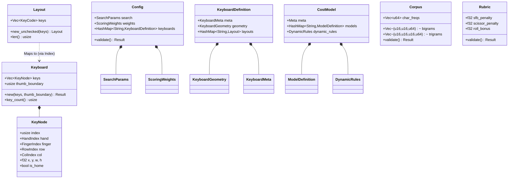
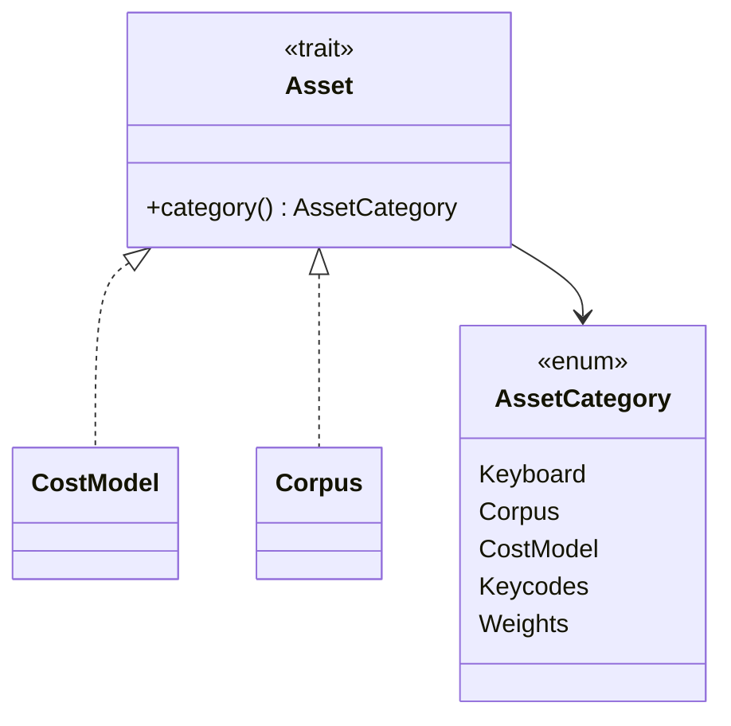

# Design: KeyForge Model

**Responsibility:** Domain Entities, Strong Types, and Business Logic.
**Tier:** 1 (The Nucleus)
**Dependencies:** Pure Rust (serde, postcard, thiserror, utoipa).

## 1. The Domain Dictionary

`keyforge-model` defines the "Ubiquitous Language" of the system. These types are the **Single Source of Truth**.

### Domain Entity Map



### Physical Entities (Hardware)

| Type | Description | Invariant |
| :--- | :--- | :--- |
| **`Keyboard`** | The physical device with `KeyNode` vector and thumb boundary. | Immutable during optimization. |
| **`KeyNode`** | A single key with spatial coordinates (`x`, `y`), finger assignment, row/col. | Must have valid `HandIndex` and `FingerIndex`. |
| **`KeyIndex(u16)`** | Newtype for physical key position. | `0 <= index < key_count`. |
| **`CostModel`** | External physics model with static costs and dynamic rules. | Loaded from `cost_matrix.json`. |

### Logical Entities (Software)

| Type | Description | Invariant |
| :--- | :--- | :--- |
| **`Layout`** | A mapping of `KeyCode`s to `KeyIndex`es. | Length must match keyboard. |
| **`Corpus`** | N-gram frequency data (char_freqs, bigrams, trigrams). | Frequencies are `u64`. |
| **`Rubric`** | Scoring weights and penalties. | Weights must be finite. |
| **`SearchConfig`** | Optimization parameters (Annealing variant). | `temp_min < temp_max`. |

### Result Types

| Type | Description |
| :--- | :--- |
| **`OptimizationResult`** | Final score + layout from optimization |
| **`ScoringResult`** | Alias for `OptimizationResult` |
| **`AnalysisReport`** | Detailed breakdown (SFBs, rolls, scissors, heatmaps) |
| **`SwapSuggestion`** | Proposed key swap with delta |
| **`MetricViolation`** | Individual N-gram violation detail |

## 2. The Semantic Firewall (Newtypes)

To prevent "Argument Swapping" bugs, we use the **Newtype Pattern** extensively.

### Core Types

| Type | Inner | Description |
| :--- | :--- | :--- |
| **`KeyIndex`** | `u16` | Index into `Keyboard.keys` |
| **`KeyCode`** | `u16` | Logical character/modifier ID (`EMPTY = 0`) |
| **`Score`** | `i64` | Fixed-point score (scaled by `SCORE_SCALE`) |
| **`HandIndex`** | `u8` | 0 (Left) or 1 (Right) |
| **`FingerIndex`** | `u8` | 0 (Thumb) to 4 (Pinky) |
| **`RowIndex`** | `i8` | Row relative to home row |
| **`ColIndex`** | `i8` | Column index |

### Score Arithmetic

`Score` uses **checked arithmetic** to prevent silent overflow:

```rust
impl Score {
    pub const MAX: Score = Score(i64::MAX);
    pub const INFINITY_SENTINEL: Score = Score(i64::MAX);
    
    pub fn from_f32(val: f32) -> Result<Score, String>;
    pub fn to_f32(self) -> f32;
    pub fn checked_add(self, other: Score) -> Option<Score>;
    pub fn checked_mul(self, factor: i64) -> Option<Score>;
}
```

## 3. Asset System

Types can declare themselves as loadable assets:



## 4. Validation Strategy (The Hybrid Doctrine)

### A. Strict Construction (Logic Entities)

Small, logic-heavy entities must **never** exist in an invalid state.

* **Target:** `HandIndex`, `FingerIndex`, `Keyboard`
* **Mechanism:** Private fields + `TryFrom` / `new()`
* **Guarantee:** If you hold it, it is valid

### B. Deferred Validation (Data Aggregates)

Large configuration structs use public fields for easy serialization but require explicit validation.

* **Target:** `Config`, `Corpus`, `Rubric`, `KeyboardDefinition`
* **Mechanism:** `Validator` trait
* **Enforcement:** At system boundary (API, file loader, WASM bridge)

```rust
pub trait Validator {
    fn validate(&self) -> Result<(), String>;
}

pub trait LayoutValidator {
    fn validate_layout(&self, layout: &Layout) -> Result<(), String>;
}
```

### C. Validation Matrix

| Entity | Validation Rules | Enforcement | Mechanism |
| :--- | :--- | :--- | :--- |
| **`HandIndex`** | Must be 0 or 1 | Construction | `TryFrom<u8>` |
| **`FingerIndex`** | Must be 0..=4 | Construction | `TryFrom<u8>` |
| **`Keyboard`** | Non-empty keys, valid thumb boundary | Construction | `Keyboard::new()` |
| **`Layout`** | Length matches keyboard | Deferred | `LayoutValidator` |
| **`Corpus`** | Frequencies non-empty | Deferred | `Validator::validate()` |
| **`Rubric`** | Floats finite, penalties non-negative | Deferred | `Validator::validate()` |
| **`SearchConfig`** | `temp_min < temp_max`, steps > 0 | Deferred | `Validator::validate()` |

## 5. Serialization & Hashing

* **Postcard:** Internal binary serialization for deterministic `JobIdentifier` hashes
* **JSON (serde_json):** External configuration files
* **ts-rs:** TypeScript bindings generation (feature flag `ts_bindings`)
* **utoipa:** OpenAPI schema derivation

## 6. Module Structure

```
keyforge-model/src/
├── config/
│   ├── aggregate.rs    # Config aggregate root
│   ├── constraints.rs  # KeyConstraint
│   ├── definitions.rs  # LayoutDefinitions
│   ├── metadata.rs     # ConfigMeta
│   ├── search.rs       # SearchConfig, SearchParams
│   ├── source.rs       # CorpusSource, CostMatrixSource
│   └── weights.rs      # ScoringWeights
├── geometry/
│   ├── definition.rs   # KeyboardDefinition
│   ├── geometry.rs     # KeyboardGeometry
│   ├── meta.rs         # KeyboardMeta
│   └── node.rs         # KeyNode
├── utils/              # Internal helpers
├── asset.rs            # Asset trait, AssetCategory
├── constants.rs        # SCORE_SCALE, limits
├── corpus.rs           # Corpus
├── cost_model.rs       # CostModel, DynamicRules
├── error.rs            # ForgeError
├── job.rs              # JobIdentifier
├── keyboard.rs         # Keyboard aggregate
├── keycodes.rs         # KeycodeRegistry
├── layout.rs           # Layout
├── parsing.rs          # QMK/ZMK parsing
├── rubric.rs           # Rubric
├── types.rs            # Newtypes, result types
├── validator.rs        # Validator, LayoutValidator traits
└── lib.rs              # Public exports
```

## 7. Feature Flags

| Flag | Purpose |
| :--- | :--- |
| `ts_bindings` | Enables `ts-rs` for TypeScript definition generation |
| `testing` | Exposes `testing` module with proptest strategies |
