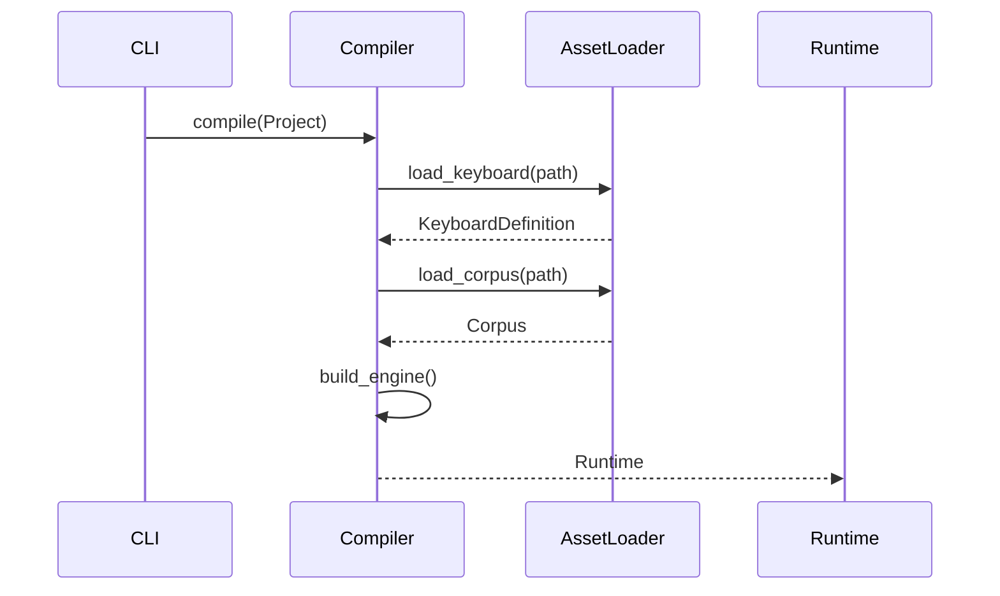

# Design: KeyForge Persistence

**Responsibility:** Project state management and compilation.
**Tier:** 3 (The Adapter)

## 1. The Compiler Pattern

We distinguish between the **Stored State** (`Project`) and the **Executable State** (`Runtime`).

* **Project:** JSON-serializable DTO. Contains paths ("./data/corpus.json") and settings.
* **Runtime:** In-memory object graph. Contains loaded data (`Vec<Bigram>`) and lookup tables.

## 2. Autosave Service

Background service to persist the user's session state.

* **Strategy:** Debounced writes.
* **Format:** JSON Snapshot.
