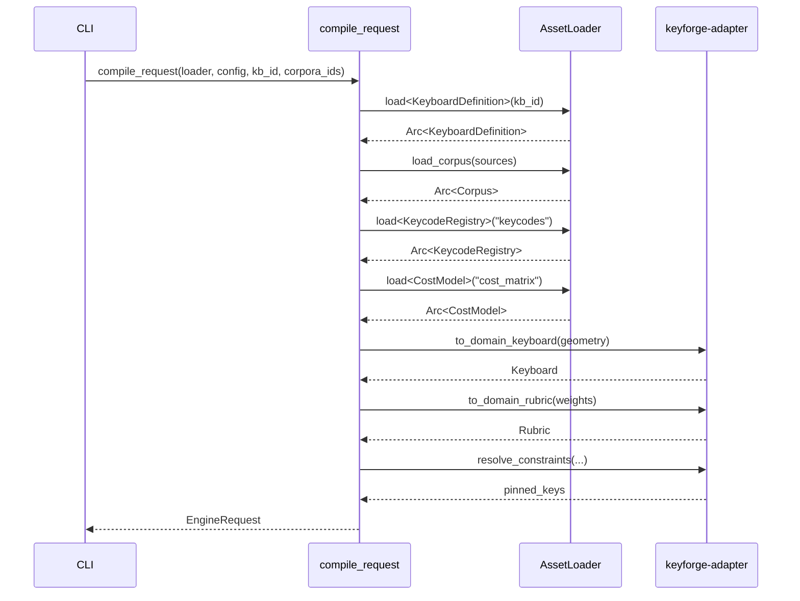
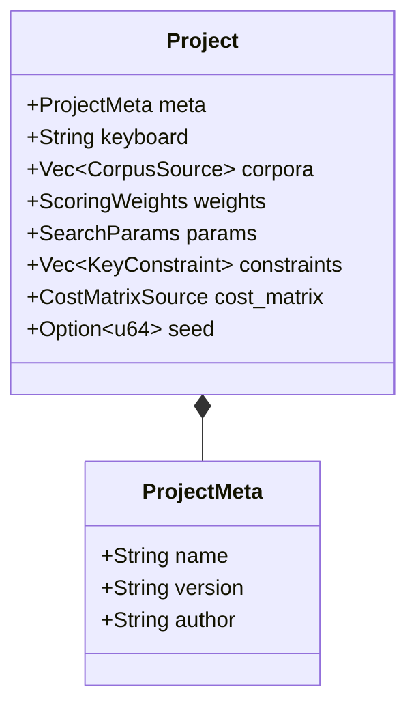
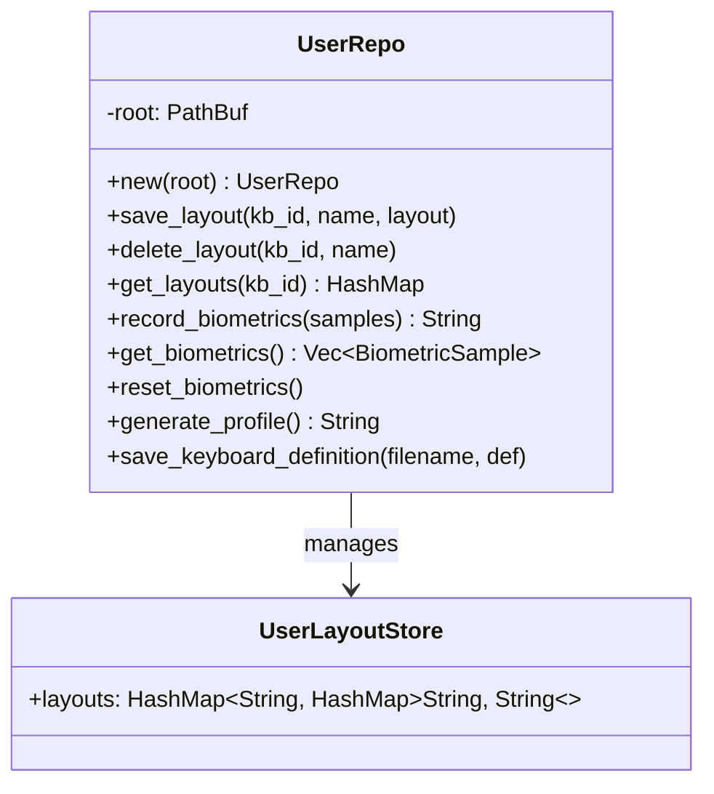
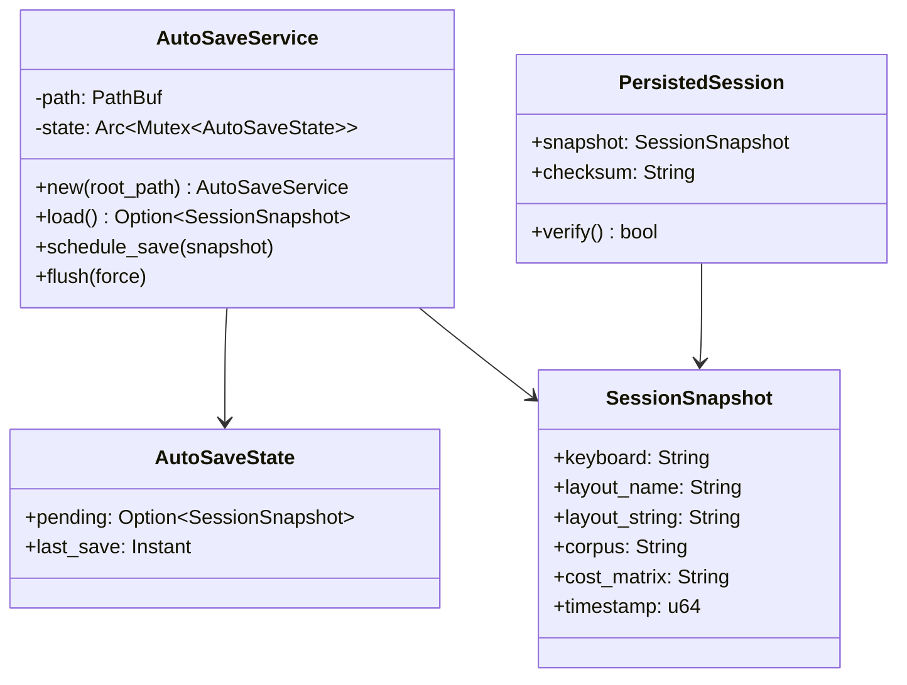
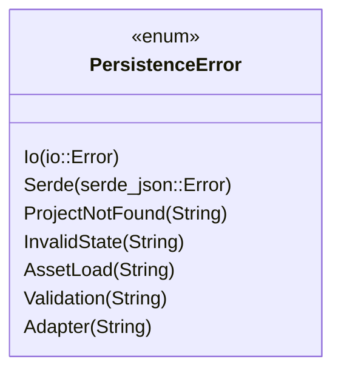

# Design: KeyForge Persistence

**Responsibility:** Project state management, user data storage, and request compilation.
**Tier:** 3 (The Adapter)

## 1. The Compiler Pattern

We distinguish between the **Stored State** (`Project`, `Config`) and the **Executable State** (`EngineRequest`).



## 2. Project Definition

A persistable definition of an optimization experiment:



**Format:** JSON-serializable. Contains paths/IDs ("corne", "text/en_std") and settings.

## 3. User Repository

`UserRepo` manages user-specific persistent data on the local filesystem:



### Biometrics Storage

- **Format:** JSONL (newline-delimited JSON) at `user/user_stats.jsonl`
- **Locking:** Exclusive file lock during append
- **Streaming:** `load_stats_streaming()` for memory-efficient processing
- **Profile Generation:** Requires `MIN_BIOMETRIC_SAMPLES` before generating `personal_cost.json`

## 4. Autosave Service

Background service for debounced session persistence:



### Debounce Strategy

- **Interval:** 2 seconds minimum between saves
- **Atomic Writes:** Uses `tempfile` + rename
- **Checksum:** SHA-256 for integrity verification
- **Legacy Support:** Can load old format without checksum

## 5. Error Handling



## 6. Module Structure

```
keyforge-persistence/src/
├── repo/
│   ├── mod.rs
│   └── user_repo.rs      # UserRepo, UserLayoutStore
├── store/
│   ├── mod.rs
│   └── autosave.rs       # AutoSaveService, SessionSnapshot
├── compiler.rs           # compile_request()
├── error.rs              # PersistenceError
├── project.rs            # Project, ProjectMeta
└── lib.rs                # Re-exports
```

## 7. Data Files

| Path | Format | Purpose |
|------|--------|---------|
| `user/user_layouts.json` | JSON | Saved layouts per keyboard |
| `user/user_stats.jsonl` | JSONL | Biometric samples log |
| `user/personal_cost.json` | JSON | Generated personalized cost profile |
| `user/keyboards/*.json` | JSON | Custom keyboard definitions |
| `session.json` | JSON | Autosaved session snapshot |
