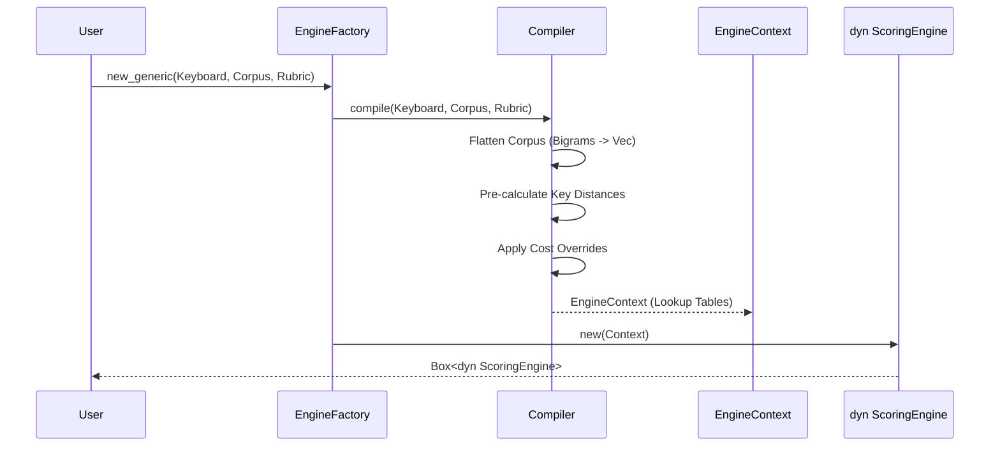
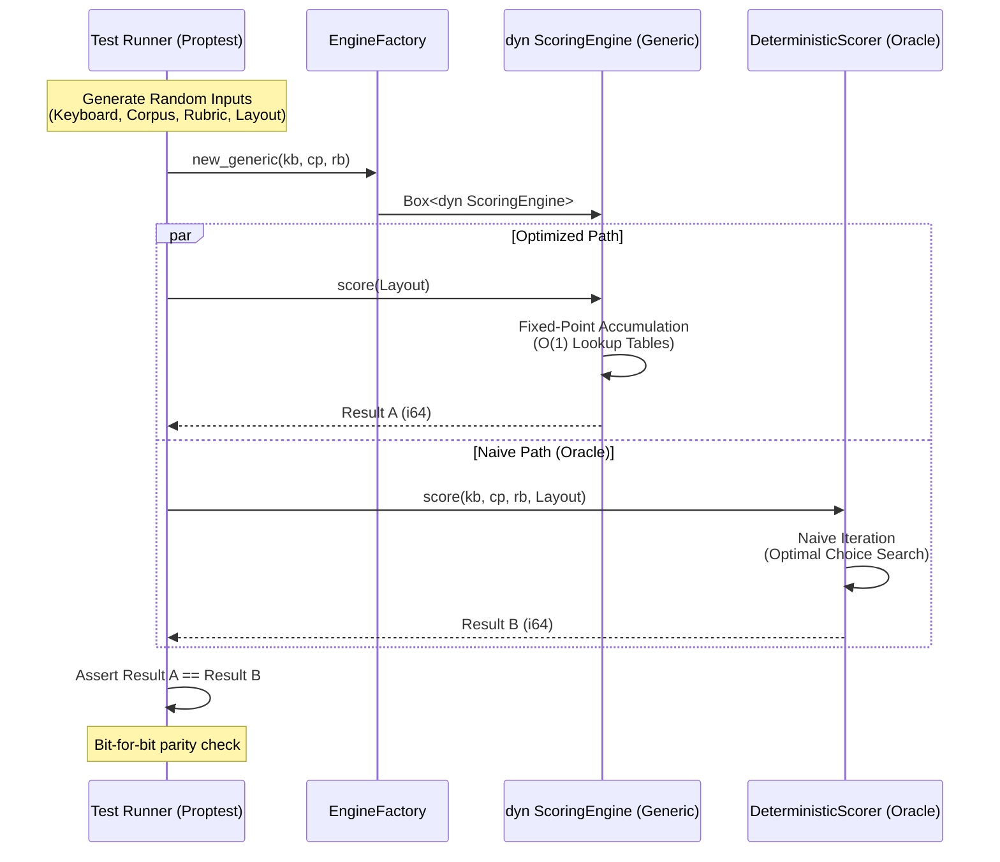
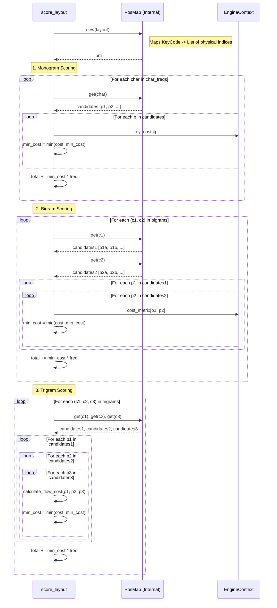

# Design: KeyForge Physics

**Responsibility:** Pure mathematical scoring of keyboard layouts.
**Tier:** 1 (The Nucleus)

## 1. The Scoring Engine (Multi-Tiered)

The `ScoringEngine` is a trait that defines the interface for evaluating keyboard layouts. It is a read-only component optimized for O(1) lookups. It does not store the layout; it calculates the cost of applying a layout to a physical keyboard.

### Compilation Process

## 2. The Oracle Pattern (Verification)

To ensure the optimized engine remains mathematically sound despite aggressive optimizations (flattened lookups, bit-shifting, and integer scaling), we employ a "Shadow Execution" strategy. Every property test compares the high-performance engine against the `DeterministicScorer`.

### Oracle Parity Sequence

## 3. Detailed Scoring Logic (Optimal Choice)

The engine assumes the user is an **"Optimal Typist."** For layouts with duplicate keys (e.g., bilateral spacebars or experimental layer mappings), the engine dynamically selects the physical key (or sequence of keys) that minimizes the total cost for every monogram, bigram, and trigram.

This logic ensures that adding redundant keys always improves or maintains the score, never degrades it, by finding the mathematical lower bound of effort for the given layout.

### Dynamic Search Sequence

## 4. Key Components

* **Compiler:** Transforms domain entities into `EngineContext`. It handles the heavy lifting of spatial math and corpus pruning so the scoring loop remains tight.
* **Compute Kernel:** The hot-path logic for monogram, bigram, and trigram scoring.
* **Heuristics:** Provides fast swap suggestions by calculating score deltas rather than full re-scores.
* **Fingerprinter:** Uses Hamming distance to identify known layout standards (Qwerty, Dvorak, etc.).
