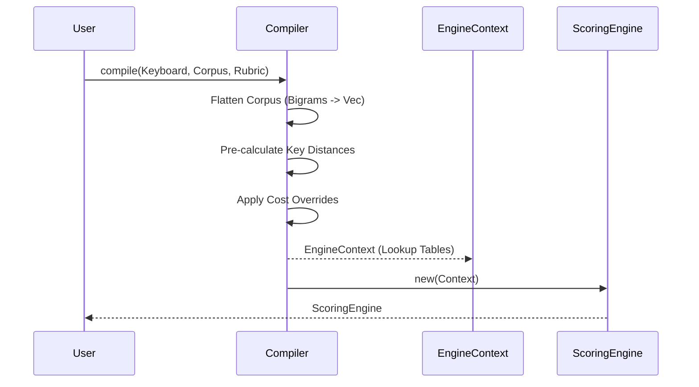
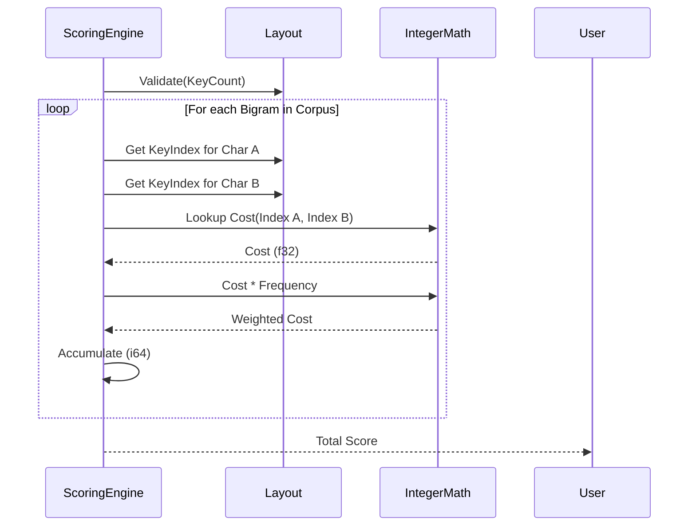

# Design: KeyForge Physics

**Responsibility:** Pure mathematical scoring of keyboard layouts.
**Tier:** 1 (The Nucleus)

## 1. The Scoring Engine

The `ScoringEngine` is a compiled, read-only struct optimized for O(1) lookups. It does not store the layout; it calculates the cost of applying a layout to a physical keyboard.

### Compilation Process

### Scoring Loop (Hot Path)

## 2. Invariants

1. **Integer Arithmetic:** All accumulation happens in `i64` to prevent floating-point drift. `f32` is only used for the initial cost lookup.
2. **Immutability:** The `ScoringEngine` is thread-safe (`Sync`) and never changes state.
3. **Determinism:** Given the same inputs, `score()` must return the exact same bitwise result.
