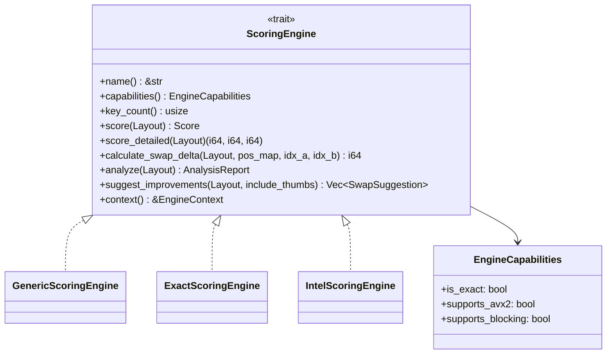
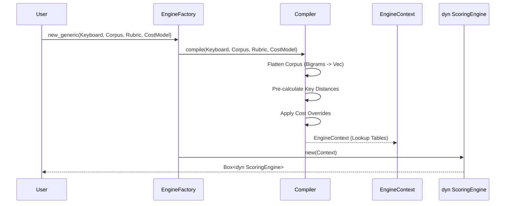
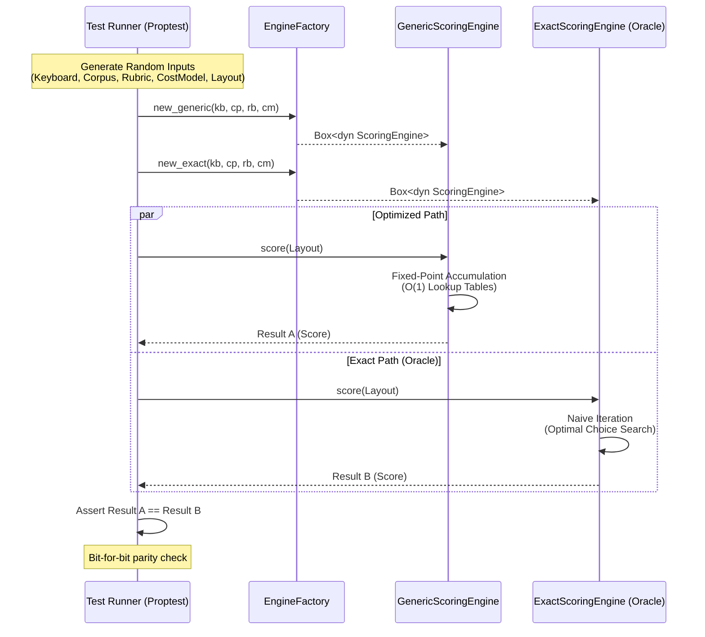
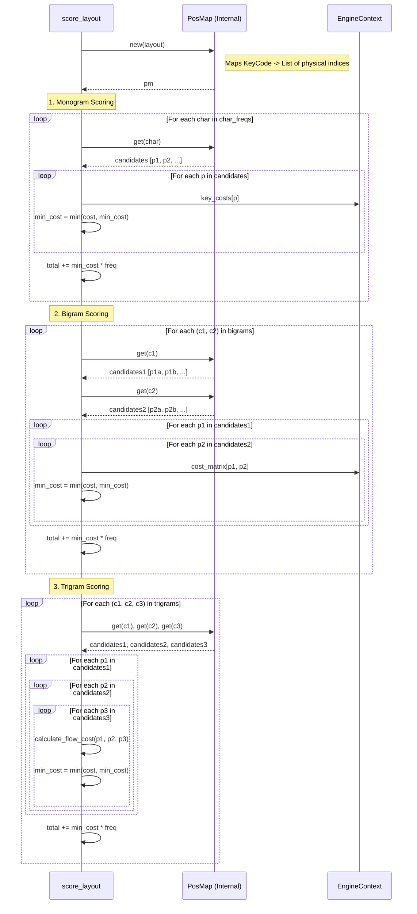

# Design: KeyForge Physics

**Responsibility:** Pure mathematical scoring of keyboard layouts.
**Tier:** 1 (The Nucleus)

## 1. The Scoring Engine (Multi-Tiered)

The `ScoringEngine` trait defines the interface for evaluating keyboard layouts. It is a read-only component optimized for O(1) lookups. Multiple engine implementations exist for different performance/accuracy trade-offs.

### Engine Implementations

| Engine | Purpose | Capabilities |
|--------|---------|--------------|
| `GenericScoringEngine` | Default optimized engine | Fast, portable |
| `ExactScoringEngine` | Oracle for verification | Bit-perfect, slow |
| `IntelScoringEngine` | Hardware-accelerated | AVX2, cache-aware blocking |



### Compilation Process



## 2. The Oracle Pattern (Verification)

To ensure the optimized engines remain mathematically sound despite aggressive optimizations (flattened lookups, bit-shifting, and integer scaling), we employ a "Shadow Execution" strategy. Every property test compares the high-performance engine against the `ExactScoringEngine`.

### Oracle Parity Sequence



## 3. Detailed Scoring Logic (Optimal Choice)

The engine assumes the user is an **"Optimal Typist."** For layouts with duplicate keys (e.g., bilateral spacebars or experimental layer mappings), the engine dynamically selects the physical key (or sequence of keys) that minimizes the total cost for every monogram, bigram, and trigram.

This logic ensures that adding redundant keys always improves or maintains the score, never degrades it, by finding the mathematical lower bound of effort for the given layout.

### Dynamic Search Sequence



## 4. Public API

The crate exposes these top-level functions for one-off operations:

| Function | Purpose |
|----------|---------|
| `score(EngineRequest)` | Score a layout |
| `analyze(EngineRequest)` | Generate detailed `AnalysisReport` |
| `identify(Layout)` | Match layout to known standards (Qwerty, Dvorak, etc.) |
| `suggest_improvements(EngineRequest)` | Get swap suggestions filtered by pinned keys |

## 5. Module Structure

```
keyforge-physics/src/
├── engines/
│   ├── exact.rs          # ExactScoringEngine (Oracle)
│   ├── generic.rs        # GenericScoringEngine (Default)
│   ├── intel_comet_lake.rs # IntelScoringEngine (AVX2)
│   └── mod.rs            # ScoringEngine trait, EngineCapabilities
├── kernel/
│   ├── compute/          # Hot-path scoring logic
│   ├── stages/           # Compilation pipeline stages
│   ├── compiler.rs       # Transforms domain -> EngineContext
│   ├── mechanics.rs      # Physical key mechanics
│   └── types.rs          # ValidatedLayout, internal types
├── analysis/
│   ├── fingerprint.rs    # Layout identification (Hamming distance)
│   └── heuristics.rs     # Swap suggestion algorithms
├── verify.rs             # Layout validation
├── error.rs              # PhysicsError
└── lib.rs                # EngineFactory, public API
```
