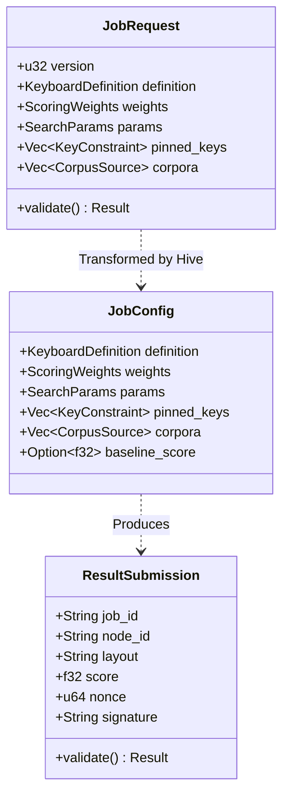

# Design: KeyForge Protocol

**Responsibility:** Data Transfer Objects (DTOs), API Contract, and Error Registry.
**Tier:** 2 (The Contract)
**Dependencies:** `keyforge-model`.

## 1. The Wire Contract

This crate defines the shape of data sent over HTTP and WebSockets. It acts as the **Anti-Corruption Layer** between the outside world (JSON) and the internal domain (`keyforge-model`).

### DTO Structure Map

This diagram shows the Data Transfer Objects used to communicate between the Client, Server (Hive), and Worker (Agent).



## 2. Validation Strategy (The Bouncer Pattern)

The Protocol layer acts as the **Bouncer** for the system. It enforces "Envelope Integrity" before allowing data to reach the Domain.

### Responsibilities

1.  **Protocol Validation (The Envelope):**
    *   **Versioning:** Is `version` compatible?
    *   **Limits:** Is the payload too large? (e.g., `biometrics.len() > 10,000`).
    *   **Structure:** Are required fields present?

2.  **Domain Delegation (The Payload):**
    *   The DTO **must** call `.validate()` on all embedded Domain Entities (`KeyboardDefinition`, `ScoringWeights`).
    *   This ensures that business rules (e.g., "Weights must be positive") are enforced at the API boundary.

## 3. Security & DoS Protection

To prevent memory exhaustion attacks via massive JSON payloads, we enforce strict limits on collection sizes during deserialization.

* **Mechanism:** `#[serde(deserialize_with = "keyforge_model::serde_utils::deserialize_limited_vec")]`
* **Limit:** Vectors are capped at 100,000 items.
* **Target:** `biometrics`, `pinned_keys`, `corpora`.

## 4. The Error Registry

We use a centralized `ErrorCode` enum to ensure consistent error handling across the stack (Rust Backend -> TypeScript Frontend).

```rust
#[derive(strum::Display, EnumString)]
#[serde(rename_all = "SCREAMING_SNAKE_CASE")]
pub enum ErrorCode {
    // Domain Errors
    JOB_VALIDATION_FAILED,
    PHYSICS_VIOLATION,
    
    // Infra Errors
    DATABASE_ERROR,
    AUTH_INVALID,
}
```

**Invariant:** Every error returned by the API must map to a specific `ErrorCode`.

## 5. TypeScript Integration

To ensure the Frontend (`keyforge-ui`) stays in sync with the Backend, we use `ts-rs` to generate TypeScript definitions from Rust structs.

* **Feature Flag:** `ts_bindings`. Must be enabled explicitly to generate bindings.
* **Source:** `#[derive(TS)]` on DTOs.
* **Output:** `bindings/` directory.
* **Usage:** The Frontend imports these types directly, ensuring compile-time safety across the network boundary.

## 6. Versioning

* **`PROTOCOL_VERSION`**: A monotonic integer incremented whenever the wire format changes in a breaking way.
* **Handshake:** Clients and Workers must announce their version on connection. The Server rejects incompatible versions.
