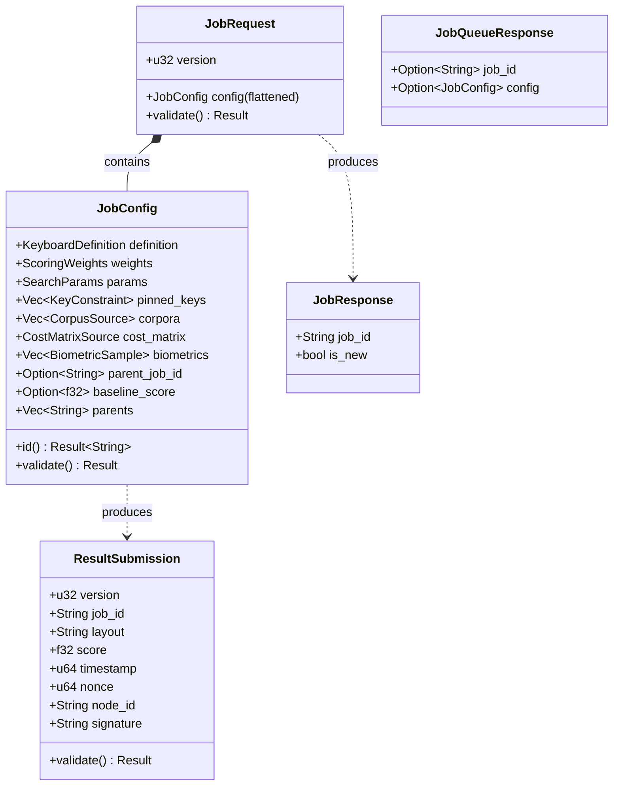
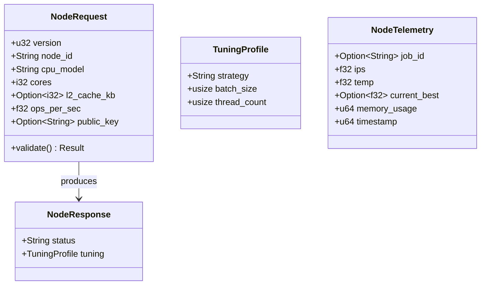
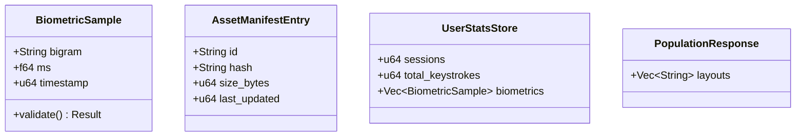
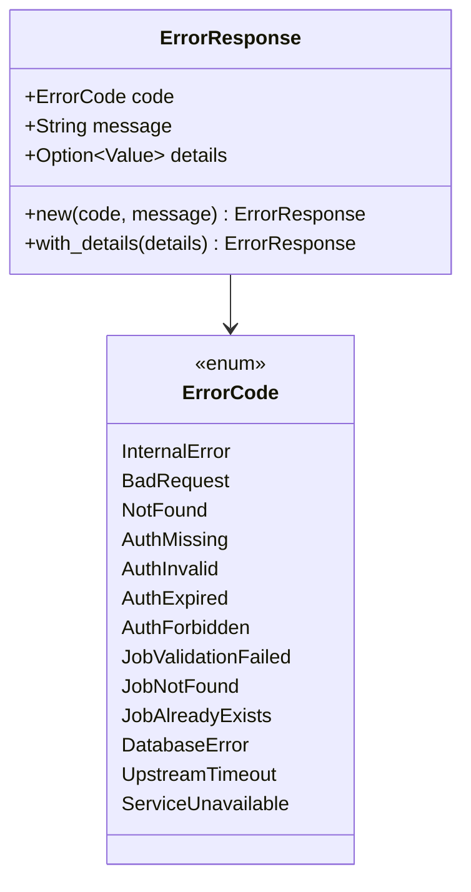

# Design: KeyForge Protocol

**Responsibility:** Data Transfer Objects (DTOs), API Contract, and Error Registry.
**Tier:** 2 (The Contract)
**Dependencies:** `keyforge-model`.

## 1. The Wire Contract

This crate defines the shape of data sent over HTTP and WebSockets. It acts as the **Anti-Corruption Layer** between the outside world (JSON) and the internal domain (`keyforge-model`).

### DTO Structure Map



### Worker Node DTOs



### Asset DTOs



## 2. Validation Strategy (The Bouncer Pattern)

The Protocol layer acts as the **Bouncer** for the system. It enforces "Envelope Integrity" before allowing data to reach the Domain.

### Responsibilities

1. **Protocol Validation (The Envelope):**
   - **Versioning:** Is `version` compatible?
   - **Limits:** Is the payload too large? (e.g., `biometrics.len() > MAX_BIOMETRIC_SAMPLES`)
   - **Structure:** Are required fields present?
   - **Timestamps:** Is the submission within acceptable time skew?

2. **Domain Delegation (The Payload):**
   - The DTO **must** call `.validate()` on all embedded Domain Entities
   - Ensures business rules (e.g., "Weights must be positive") are enforced at API boundary

## 3. Security & DoS Protection

To prevent memory exhaustion attacks via massive JSON payloads, we enforce strict limits on collection sizes during deserialization.

```rust
#[serde(deserialize_with = "crate::serde_utils::deserialize_limited_vec")]
pub pinned_keys: Vec<KeyConstraint>,  // Capped at 100,000 items
```

**Protected Fields:** `biometrics`, `pinned_keys`, `corpora`, `layouts`.

## 4. The Error Registry

Centralized `ErrorCode` enum for consistent error handling across the stack:



**Invariant:** Every API error maps to a specific `ErrorCode`.

## 5. Versioning

```rust
pub const PROTOCOL_VERSION: u32 = 2;
pub const MIN_CLIENT_VERSION: u32 = 1;
pub const MIN_SERVER_VERSION: u32 = 1;

pub fn check_version_compatibility(client: u32, server: u32) -> Result<(), String>;
```

Clients and Workers announce their version on connection. The Server rejects incompatible versions.

## 6. TypeScript Integration

To ensure the Frontend (`keyforge-ui`) stays in sync with the Backend:

- **Feature Flag:** `ts_bindings`
- **Mechanism:** `#[derive(TS)]` on DTOs
- **Output:** `bindings/` directory
- **Usage:** Frontend imports types directly for compile-time safety

## 7. Module Structure

```
keyforge-protocol/src/
├── assets.rs      # BiometricSample, AssetManifestEntry, UserStatsStore, PopulationResponse
├── constants.rs   # Limits (MAX_BIOMETRIC_SAMPLES, time skew thresholds)
├── error.rs       # ErrorCode, ErrorResponse
├── job.rs         # JobRequest, JobConfig, JobResponse, JobQueueResponse, ResultSubmission
├── node.rs        # NodeRequest, NodeResponse, NodeTelemetry, TuningProfile
├── serde_utils.rs # deserialize_limited_vec
├── telemetry.rs   # SystemMetrics
└── lib.rs         # Re-exports, version constants
```

## 8. Key Constants

| Constant | Value | Purpose |
|----------|-------|---------|
| `PROTOCOL_VERSION` | 2 | Current wire format version |
| `MAX_BIOMETRIC_SAMPLES` | 10,000 | DoS protection limit |
| `MAX_FUTURE_SKEW_SEC` | 300 | Timestamp validation (5 min) |
| `MAX_PAST_SKEW_SEC` | 86400 | Timestamp validation (24 hr) |
| `MAX_BIOMETRIC_MS` | 10,000 | Realistic typing latency ceiling |
