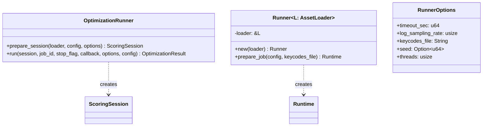
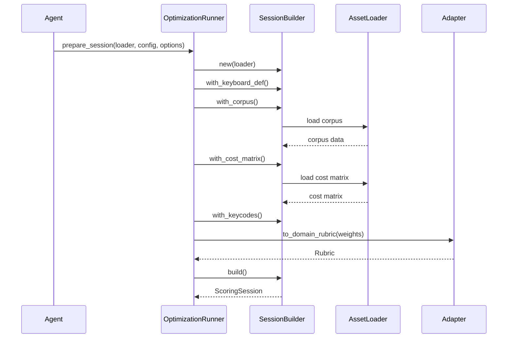
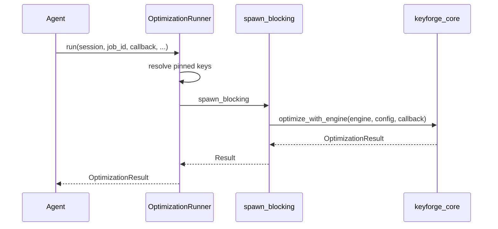

# Design: KeyForge Runner

**Responsibility:** High-level optimization orchestration for distributed workers.
**Tier:** 2 (The Glue)

## 1. Overview

`keyforge-runner` provides the `OptimizationRunner` and `Runner` abstractions that wire together compute, core, and adapter layers to execute optimization jobs. It acts as the bridge between job configuration (from `keyforge-protocol`) and the actual scoring/evolution machinery.

## 2. Session Preparation Flow

The runner loads all required assets (corpus, cost matrix, keycodes) and constructs a `ScoringSession` ready for optimization.

## 3. Optimization Execution

Once prepared, the runner spawns a blocking task to execute the optimization loop.

## 4. Dependencies

| Crate | Purpose |
|-------|---------|
| `keyforge-compute` | `SessionBuilder`, `Runtime` |
| `keyforge-core` | `ScoringSession`, `optimize_with_engine` |
| `keyforge-adapter` | `to_domain_rubric` conversion |
| `keyforge-protocol` | `JobConfig` DTO |
| `keyforge-model` | Domain types (`KeyCode`, `OptimizationResult`) |
| `keyforge-infra` | Asset loading infrastructure |
