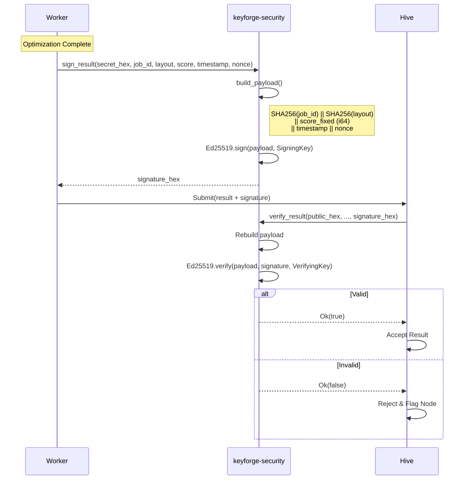
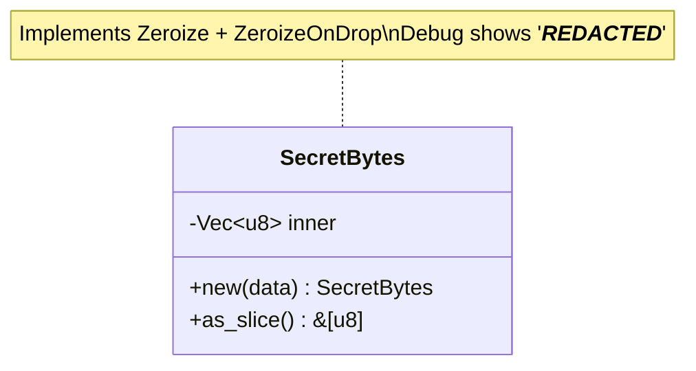
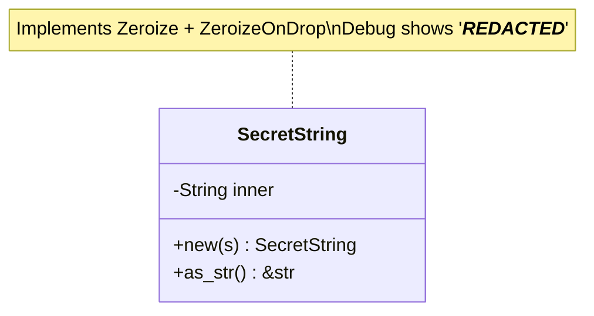
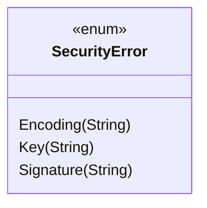

# Design: KeyForge Security

**Responsibility:** Cryptographic signing and secret management.
**Tier:** 2 (The Shield)
**Dependencies:** `ed25519-dalek`, `sha2`, `zeroize`, `hex`.

## 1. Public API

| Function | Purpose |
|----------|---------|
| `generate_keypair()` | Generate Ed25519 keypair (hex strings) |
| `generate_nonce()` | Generate cryptographic random `u64` |
| `sign_result(secret_hex, ...)` | Sign result from hex key |
| `sign_result_direct(SigningKey, ...)` | Sign with pre-loaded key |
| `verify_result(public_hex, ..., sig_hex)` | Verify signature |

## 2. Result Signing Protocol

To prevent malicious workers from submitting fake high scores, every result is signed using Ed25519.



### Payload Structure

The signed payload is deterministic (88 bytes):

| Field | Size | Description |
|-------|------|-------------|
| `job_hash` | 32 bytes | SHA256(job_id) |
| `layout_hash` | 32 bytes | SHA256(layout) |
| `score_fixed` | 8 bytes | `(score * SCORE_SCALE) as i64` (LE) |
| `timestamp` | 8 bytes | Unix timestamp (LE) |
| `nonce` | 8 bytes | Random nonce (LE) |

**Note:** Score is converted to fixed-point before signing to ensure deterministic signatures across platforms.

## 3. Secret Management

### SecretBytes

Zeroized wrapper for sensitive binary data (e.g., private keys):



### SecretString

Zeroized wrapper for sensitive text (e.g., passwords, API keys):



## 4. Error Handling



| Variant | Cause |
|---------|-------|
| `Encoding` | Invalid hex encoding |
| `Key` | Invalid key length or format |
| `Signature` | Invalid signature length or verification failure |

## 5. Security Properties

| Property | Implementation |
|----------|----------------|
| **Memory Safety** | `SecretBytes`/`SecretString` use `zeroize` to wipe data on drop |
| **No Logging** | Secrets never implement `Display`; `Debug` shows `***REDACTED***` |
| **Whitespace Tolerance** | Hex inputs are trimmed before parsing |
| **Deterministic Signing** | Fixed-point score conversion via `SCORE_SCALE` |
| **Replay Prevention** | Cryptographic nonce via `generate_nonce()` |

## 6. Keypair Generation

```rust
pub fn generate_keypair() -> (String, String) {
    // Returns (signing_key_hex, verifying_key_hex)
    // Uses OsRng (CSPRNG)
}
```

Workers generate a keypair on first run and register the public key with Hive.

## 7. Module Structure

```
keyforge-security/src/
└── lib.rs   # All types and functions
```

Single-file crate for cryptographic primitives:
- `SecretBytes`, `SecretString` - zeroized wrappers
- `SecurityError`, `SecurityResult<T>` - error types
- `generate_keypair()`, `generate_nonce()` - key/nonce generation
- `sign_result()`, `sign_result_direct()` - signing
- `verify_result()` - verification
