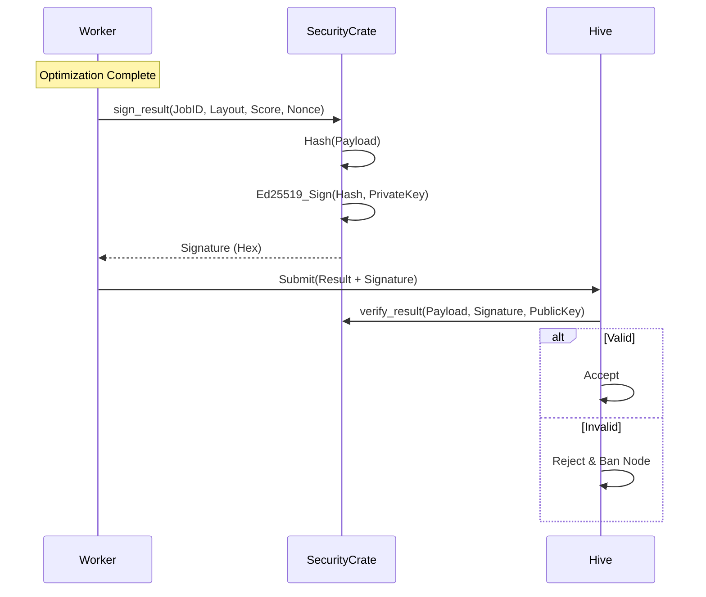

# Design: KeyForge Security

**Responsibility:** Cryptographic signing and secret management.
**Tier:** 2 (The Shield)

## 1. Result Signing Protocol

To prevent malicious workers from submitting fake high scores, every result is signed.

## 2. Memory Safety

* **SecretBytes:** Uses `zeroize` to wipe private keys from memory when dropped.
* **No Logging:** Secrets are never implemented with `Debug` or `Display`.
