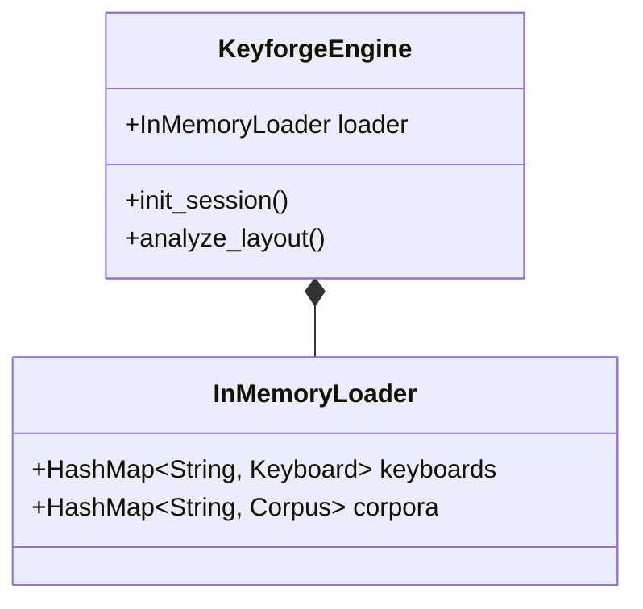

# Design: KeyForge WASM

**Responsibility:** Browser bindings for the Core engine.
**Tier:** 3 (The Adapter)

## 1. The InMemory Loader

Since browsers have no filesystem, we inject assets directly into memory.

## 2. JS Interop

* **Serialization:** Uses `serde-wasm-bindgen` to convert JS Objects <-> Rust DTOs.
* **Panic Hook:** `console_error_panic_hook` forwards Rust panics to the JS console.
