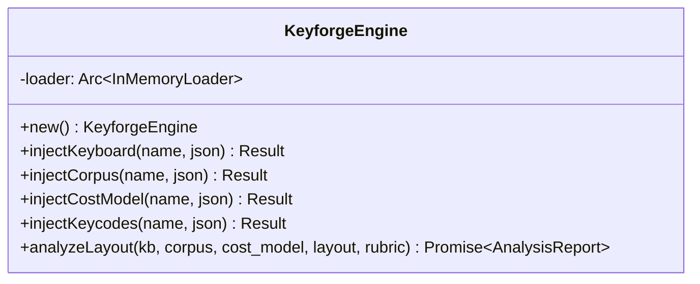
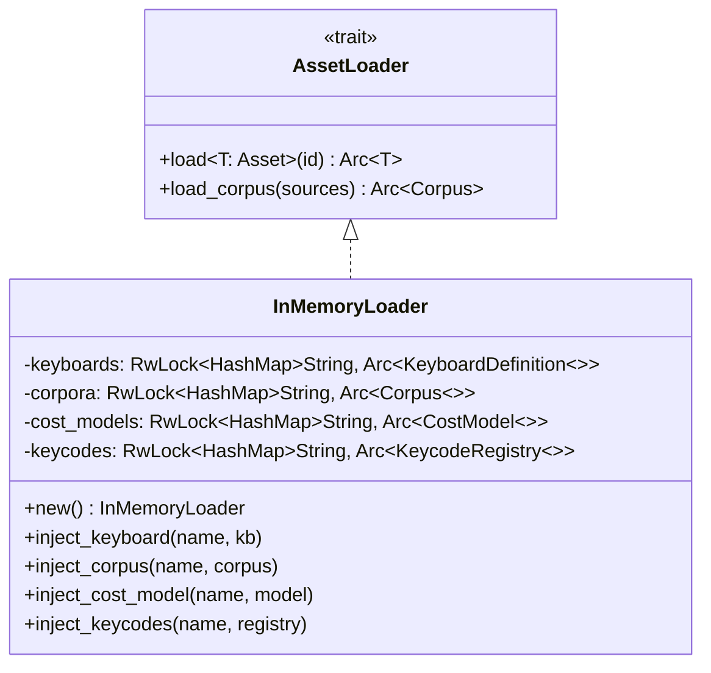
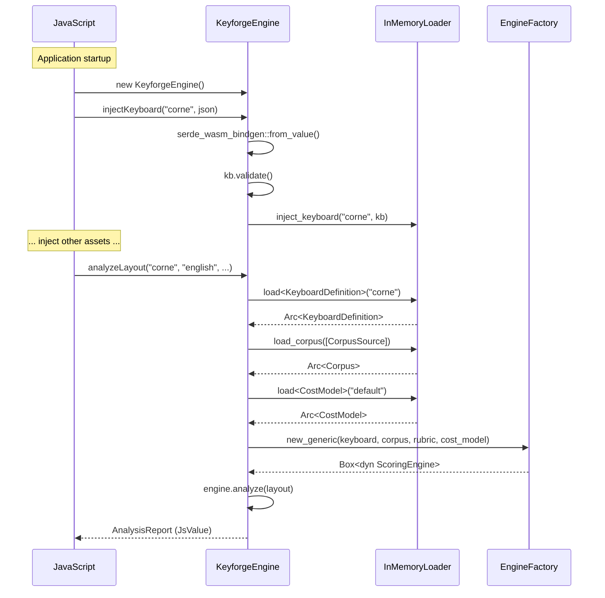

# Design: KeyForge WASM

**Responsibility:** Browser bindings for the Core engine.
**Tier:** 3 (The Adapter)
**Target:** `wasm32-unknown-unknown`

## 1. KeyforgeEngine

The main entry point for JavaScript consumers:



### JavaScript API

```javascript
const engine = new KeyforgeEngine();

// Inject assets from fetched JSON
engine.injectKeyboard("corne", keyboardJson);
engine.injectCorpus("english", corpusJson);
engine.injectCostModel("default", costModelJson);
engine.injectKeycodes("default", keycodesJson);

// Analyze a layout
const report = await engine.analyzeLayout(
  "corne",
  "english", 
  "default",
  layoutArray,
  rubricJson  // optional, can be null
);
```

## 2. InMemoryLoader

Since browsers have no filesystem, assets are injected into memory:



### Asset Resolution Flow



## 3. Supported Asset Types

| Type | Inject Method | Validation |
|------|---------------|------------|
| `KeyboardDefinition` | `injectKeyboard` | `Validator::validate()` |
| `Corpus` | `injectCorpus` | `Validator::validate()` |
| `CostModel` | `injectCostModel` | Serde only |
| `KeycodeRegistry` | `injectKeycodes` | `Validator::validate()` |

## 4. JS Interop

### Serialization

- **Rust → JS:** `serde_wasm_bindgen::to_value()`
- **JS → Rust:** `serde_wasm_bindgen::from_value()`

### Error Handling

Errors are converted to `JsValue::from_str()` and thrown as JavaScript exceptions.

### Panic Hook

```rust
console_error_panic_hook::set_once();
```

Forwards Rust panics to the browser console for debugging.

## 5. Limitations

| Feature | Supported | Notes |
|---------|-----------|-------|
| Scoring | ✅ | Via `analyzeLayout` |
| Optimization | ❌ | Too CPU-intensive for browser main thread |
| File Loading | ❌ | Assets must be pre-injected |
| Corpus Merging | ❌ | Pre-merge on server side |
| Intel Engine | ❌ | No AVX2 in WASM |

## 6. Module Structure

```
keyforge-wasm/src/
├── lib.rs      # KeyforgeEngine, wasm_bindgen exports
└── loader.rs   # InMemoryLoader (AssetLoader impl)
```

## 7. Dependencies

| Crate | Purpose |
|-------|---------|
| `wasm-bindgen` | JS↔Rust FFI |
| `serde-wasm-bindgen` | JsValue serialization |
| `console_error_panic_hook` | Panic forwarding |
| `keyforge-core` | `AssetLoader` trait |
| `keyforge-physics` | `EngineFactory`, scoring |
| `keyforge-model` | Domain types |
